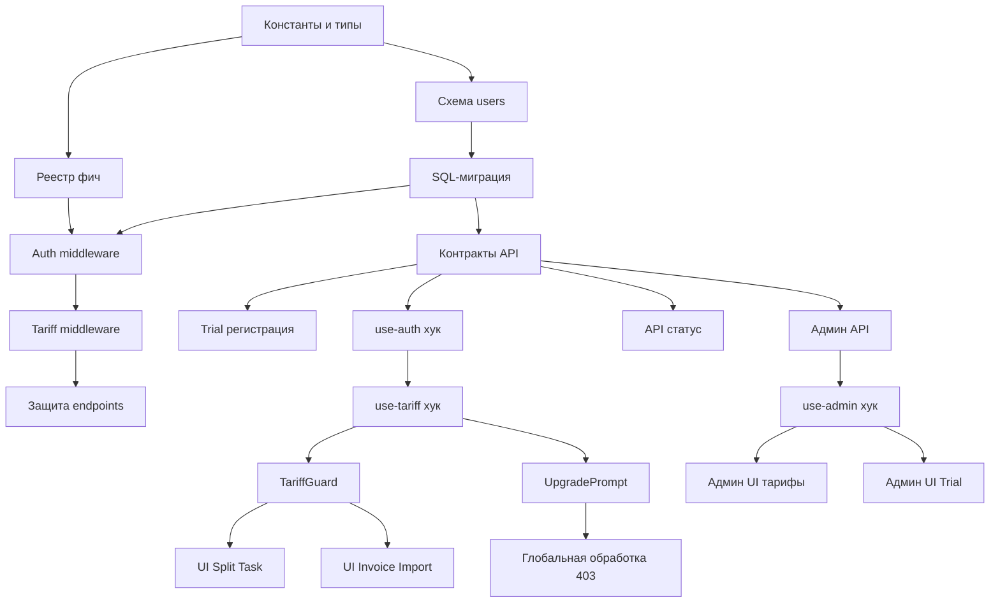

# План: Внедрение тарифной системы

**Создан:** 2026-03-06  
**Orchestration:** orch-2026-03-06-05-47-tariff-system  
**Статус:** 🟢 Готов к выполнению  
**Всего задач:** 24  
**Приоритет:** Высокий

## Цель

Внедрить систему тарифов (Базовый, Стандарт, Премиум) с ограничением доступа к функциям на трёх уровнях: база данных, backend middleware, frontend UI. Реализовать Trial-период на 14 дней и административное управление тарифами.

## Обзор задач

### Фаза 1: Модель данных (3 задачи, ~2 часа)

#### ⏳ TARIFF-001: Константы и типы тарифов
- **Приоритет:** Критический
- **Оценка:** 20 минут
- **Зависимости:** Нет
- **Файлы:** `shared/schema.ts`
- **Описание:**
  - Добавить константы `TARIFFS = ['basic', 'standard', 'premium'] as const`
  - Создать тип `TariffType = (typeof TARIFFS)[number]`
  - Подготовить базу для расширения таблицы users

#### ⏳ TARIFF-002: Расширение схемы users
- **Приоритет:** Критический
- **Оценка:** 40 минут
- **Зависимости:** TARIFF-001
- **Файлы:** `shared/schema.ts`
- **Описание:**
  - Добавить в таблицу `users`:
    - `tariff: text('tariff').notNull().default('basic')`
    - `subscription_ends_at: timestamp('subscription_ends_at')`
    - `trial_used: boolean('trial_used').notNull().default(false)`
  - Обновить Zod-схемы для users (добавить новые поля в `insertUserSchema`, `selectUserSchema`)
  - Обновить TypeScript-типы (`User`, `InsertUser`)

#### ⏳ TARIFF-003: SQL-миграция тарифов
- **Приоритет:** Критический
- **Оценка:** 1 час
- **Зависимости:** TARIFF-002
- **Файлы:** `migrations/0021_user_tariff.sql` (создать)
- **Описание:**
  - Создать SQL-миграцию для добавления новых колонок:
    ```sql
    ALTER TABLE users ADD COLUMN tariff TEXT NOT NULL DEFAULT 'basic';
    ALTER TABLE users ADD COLUMN subscription_ends_at TIMESTAMP;
    ALTER TABLE users ADD COLUMN trial_used BOOLEAN NOT NULL DEFAULT false;
    ```
  - Применить миграцию: `npm run db:migrate`
  - Проверить схему через Drizzle Studio или psql

---

### Фаза 2: Реестр фич (1 задача, ~1.5 часа)

#### ⏳ TARIFF-004: Реестр фич (shared/tariff-features.ts)
- **Приоритет:** Критический
- **Оценка:** 1.5 часа
- **Зависимости:** TARIFF-001
- **Файлы:** `shared/tariff-features.ts` (создать)
- **Описание:**
  Создать единый реестр для управления доступом к функциям. Должен содержать:
  
  **1. Уровни тарифов для сравнения:**
  ```typescript
  export const TARIFF_LEVELS: Record<TariffType, number> = {
    basic: 0,
    standard: 1,
    premium: 2,
  };
  ```
  
  **2. Маппинг фич на минимальный тариф:**
  ```typescript
  export const FEATURES = {
    SPLIT_TASK: 'standard',
    INVOICE_IMPORT: 'standard',
  } as const;
  export type FeatureKey = keyof typeof FEATURES;
  ```
  
  **3. Квоты/лимиты:**
  ```typescript
  export const QUOTAS = {
    objects: {
      basic: 1,
      standard: 5,
      premium: Infinity,
    },
    invoiceImports: {
      basic: 0,
      standard: 20,
      premium: Infinity,
    },
  };
  ```
  
  **4. Утилиты:**
  ```typescript
  // Проверка доступа к функции
  export function hasFeatureAccess(
    userTariff: TariffType,
    featureKey: FeatureKey
  ): boolean
  
  // Вычисление эффективного тарифа (с учётом истечения подписки)
  export function getEffectiveTariff(
    tariff: TariffType,
    subscriptionEndsAt: Date | null
  ): TariffType
  
  // Получение квоты для тарифа
  export function getQuota(
    tariff: TariffType,
    quotaType: 'objects' | 'invoiceImports'
  ): number
  ```

---

### Фаза 3: Backend - Middleware и защита (3 задачи, ~2 часа)

#### ⏳ TARIFF-005: Расширение auth middleware
- **Приоритет:** Высокий
- **Оценка:** 40 минут
- **Зависимости:** TARIFF-003, TARIFF-004
- **Файлы:** `server/middleware/auth.ts`
- **Описание:**
  - Добавить в тип `req.user`:
    - `tariff: TariffType`
    - `subscriptionEndsAt: Date | null`
    - `trialUsed: boolean`
  - После аутентификации вычислять эффективный тариф:
    ```typescript
    const effectiveTariff = getEffectiveTariff(
      user.tariff,
      user.subscription_ends_at
    );
    req.user.effectiveTariff = effectiveTariff;
    ```
  - Обновить импорты из `shared/tariff-features.ts`

#### ⏳ TARIFF-006: Tariff middleware (requireFeature)
- **Приоритет:** Высокий
- **Оценка:** 1 час
- **Зависимости:** TARIFF-005
- **Файлы:** `server/middleware/tariff.ts` (создать)
- **Описание:**
  Создать middleware для проверки доступа к функциям:
  ```typescript
  export function requireFeature(featureKey: FeatureKey) {
    return (req: Request, res: Response, next: NextFunction) => {
      if (!req.user) {
        return res.status(401).json({ error: 'Unauthorized' });
      }
      
      const hasAccess = hasFeatureAccess(
        req.user.effectiveTariff,
        featureKey
      );
      
      if (!hasAccess) {
        return res.status(403).json({
          error: 'TARIFF_REQUIRED',
          message: 'Upgrade to access this feature',
          feature: featureKey,
          requiredTariff: FEATURES[featureKey],
          currentTariff: req.user.effectiveTariff,
        });
      }
      
      next();
    };
  }
  ```

#### ⏳ TARIFF-007: Защита API endpoints
- **Приоритет:** Высокий
- **Оценка:** 20 минут
- **Зависимости:** TARIFF-006
- **Файлы:** `server/routes.ts`
- **Описание:**
  Навесить middleware на защищаемые endpoints:
  ```typescript
  import { requireFeature } from './middleware/tariff';
  
  // Split Task
  app.post(
    '/api/schedule-tasks/:id/split',
    requireAuth,
    requireFeature('SPLIT_TASK'),
    async (req, res) => { /* ... */ }
  );
  
  // Invoice Import
  app.post(
    '/api/parse-invoice',
    requireAuth,
    requireFeature('INVOICE_IMPORT'),
    uploadMiddleware,
    async (req, res) => { /* ... */ }
  );
  ```

---

### Фаза 4: API - Контракты и endpoints (4 задачи, ~3 часа)

#### ⏳ TARIFF-008: Обновление контрактов API (shared/routes.ts)
- **Приоритет:** Высокий
- **Оценка:** 40 минут
- **Зависимости:** TARIFF-003
- **Файлы:** `shared/routes.ts`
- **Описание:**
  - Добавить в Zod-схемы auth responses (login/register/me):
    ```typescript
    tariff: z.enum(['basic', 'standard', 'premium']),
    subscriptionEndsAt: z.string().datetime().nullable(),
    trialUsed: z.boolean(),
    ```
  - Добавить схему для админского endpoint смены тарифа:
    ```typescript
    PATCH /api/admin/users/:id/tariff
    body: {
      tariff: 'basic' | 'standard' | 'premium',
      subscriptionEndsAt?: string (ISO date)
    }
    ```
  - Добавить схему для GET /api/tariff/status

#### ⏳ TARIFF-009: Trial при регистрации
- **Приоритет:** Высокий
- **Оценка:** 1 час
- **Зависимости:** TARIFF-008
- **Файлы:** `server/routes/auth.ts`
- **Описание:**
  - В `POST /api/auth/register` и `POST /api/auth/login/telegram` (для новых пользователей):
    - Назначить `tariff = 'standard'`
    - Установить `subscription_ends_at = new Date(Date.now() + 14 * 24 * 60 * 60 * 1000)` (14 дней)
    - Установить `trial_used = true`
  - В ответах `/login`, `/register`, `/me` возвращать `tariff`, `subscriptionEndsAt`, `trialUsed`
  - Обновить `server/auth-service.ts` если логика регистрации там

#### ⏳ TARIFF-010: Админ API управления тарифами
- **Приоритет:** Средний
- **Оценка:** 1 час
- **Зависимости:** TARIFF-008
- **Файлы:** `server/routes.ts` (или `server/routes/admin.ts`)
- **Описание:**
  - Создать endpoint `PATCH /api/admin/users/:id/tariff`:
    ```typescript
    app.patch(
      '/api/admin/users/:id/tariff',
      requireAuth,
      requireAdmin,
      async (req, res) => {
        const { tariff, subscriptionEndsAt } = req.body;
        // Обновить tariff и subscription_ends_at для пользователя
        // Вернуть обновлённого пользователя
      }
    );
    ```
  - Валидация: tariff из списка допустимых, subscriptionEndsAt — валидная дата

#### ⏳ TARIFF-011: API статуса тарифа (GET /api/tariff/status)
- **Приоритет:** Низкий
- **Оценка:** 20 минут
- **Зависимости:** TARIFF-008
- **Файлы:** `server/routes.ts`
- **Описание:**
  - Создать endpoint `GET /api/tariff/status`:
    ```typescript
    response: {
      tariff: 'basic' | 'standard' | 'premium',
      effectiveTariff: 'basic' | 'standard' | 'premium',
      subscriptionEndsAt: string | null,
      trialUsed: boolean,
      quotas: {
        objects: { limit: number, used: number },
        invoiceImports: { limit: number, used: number }
      }
    }
    ```
  - Вычислить `used` через запросы к БД

---

### Фаза 5: Frontend - Хуки и компоненты (5 задач, ~3 часа)

#### ⏳ TARIFF-012: Обновление use-auth хука
- **Приоритет:** Высокий
- **Оценка:** 20 минут
- **Зависимости:** TARIFF-008
- **Файлы:** `client/src/hooks/use-auth.ts`
- **Описание:**
  - Добавить в тип `User`:
    ```typescript
    tariff: 'basic' | 'standard' | 'premium';
    subscriptionEndsAt: string | null;
    trialUsed: boolean;
    ```
  - Обновить TypeScript-типы в соответствии с API

#### ⏳ TARIFF-013: Хук use-tariff
- **Приоритет:** Высокий
- **Оценка:** 1 час
- **Зависимости:** TARIFF-012
- **Файлы:** `client/src/hooks/use-tariff.ts` (создать)
- **Описание:**
  Создать хук для работы с тарифом:
  ```typescript
  export function useTariff() {
    const { user } = useAuth();
    
    const effectiveTariff = getEffectiveTariff(
      user?.tariff,
      user?.subscriptionEndsAt
    );
    
    const hasFeature = (feature: FeatureKey) =>
      hasFeatureAccess(effectiveTariff, feature);
    
    const getQuotaInfo = (quotaType: 'objects' | 'invoiceImports') => ({
      limit: getQuota(effectiveTariff, quotaType),
      // used: ... (через отдельный query к API)
    });
    
    return {
      tariff: user?.tariff,
      effectiveTariff,
      subscriptionEndsAt: user?.subscriptionEndsAt,
      trialUsed: user?.trialUsed,
      hasFeature,
      getQuotaInfo,
    };
  }
  ```
  - Импортировать утилиты из `shared/tariff-features`

#### ⏳ TARIFF-014: Компонент TariffGuard
- **Приоритет:** Высокий
- **Оценка:** 40 минут
- **Зависимости:** TARIFF-013
- **Файлы:** `client/src/components/TariffGuard.tsx` (создать)
- **Описание:**
  Обёртка для условного рендеринга:
  ```tsx
  interface TariffGuardProps {
    feature: FeatureKey;
    fallback?: ReactNode; // Показать вместо children если нет доступа
    showUpgradePrompt?: boolean; // Показать UpgradePrompt
    children: ReactNode;
  }
  
  export function TariffGuard({
    feature,
    fallback,
    showUpgradePrompt = true,
    children,
  }: TariffGuardProps) {
    const { hasFeature } = useTariff();
    
    if (hasFeature(feature)) {
      return <>{children}</>;
    }
    
    if (fallback) {
      return <>{fallback}</>;
    }
    
    if (showUpgradePrompt) {
      return <UpgradePrompt feature={feature} />;
    }
    
    return null;
  }
  ```

#### ⏳ TARIFF-015: Компонент UpgradePrompt
- **Приоритет:** Средний
- **Оценка:** 40 минут
- **Зависимости:** TARIFF-013
- **Файлы:** `client/src/components/UpgradePrompt.tsx` (создать)
- **Описание:**
  Диалог с предложением обновить тариф:
  ```tsx
  interface UpgradePromptProps {
    feature: FeatureKey;
  }
  
  export function UpgradePrompt({ feature }: UpgradePromptProps) {
    const { effectiveTariff } = useTariff();
    const requiredTariff = FEATURES[feature];
    
    return (
      <Alert>
        <AlertCircle className="h-4 w-4" />
        <AlertTitle>Требуется тариф "{requiredTariff}"</AlertTitle>
        <AlertDescription>
          Текущий тариф: {effectiveTariff}
          <Button onClick={() => {/* navigate to settings/pricing */}}>
            Обновить тариф
          </Button>
        </AlertDescription>
      </Alert>
    );
  }
  ```
  - Использовать компоненты из shadcn/ui (Alert, Button)

#### ⏳ TARIFF-016: Глобальная обработка 403 TARIFF_REQUIRED
- **Приоритет:** Средний
- **Оценка:** 20 минут
- **Зависимости:** TARIFF-015
- **Файлы:** `client/src/lib/queryClient.ts`
- **Описание:**
  - В мутации по умолчанию (onError) проверять:
    ```typescript
    if (error.response?.status === 403 && 
        error.response?.data?.error === 'TARIFF_REQUIRED') {
      // Показать toast/modal с UpgradePrompt
      toast({
        title: 'Требуется обновление тарифа',
        description: error.response.data.message,
      });
    }
    ```

---

### Фаза 6: Интеграция в UI (2 задачи, ~1 час)

#### ⏳ TARIFF-017: Защита Split Task в UI
- **Приоритет:** Высокий
- **Оценка:** 30 минут
- **Зависимости:** TARIFF-014
- **Файлы:** Компонент с кнопкой Split Task (найти в `client/src/pages/Schedule.tsx` или `client/src/components/`)
- **Описание:**
  - Найти кнопку "Разделить задачу" (Split Task)
  - Обернуть в `<TariffGuard feature="SPLIT_TASK">`
  - Если нет доступа — показать `UpgradePrompt` или disabled-кнопку с тултипом

#### ⏳ TARIFF-018: Защита Invoice Import в UI
- **Приоритет:** Высокий
- **Оценка:** 30 минут
- **Зависимости:** TARIFF-014
- **Файлы:** Компонент импорта PDF-счетов (найти в `client/src/pages/SourceMaterials.tsx` или аналог)
- **Описание:**
  - Найти кнопку/UI импорта PDF
  - Обернуть в `<TariffGuard feature="INVOICE_IMPORT">`
  - Показать счётчик: "Использовано X из Y импортов в этом месяце" (для standard)
  - Если лимит исчерпан — показать `UpgradePrompt`

---

### Фаза 7: Админ-панель (3 задачи, ~2.5 часа)

#### ⏳ TARIFF-019: Расширение use-admin хука
- **Приоритет:** Средний
- **Оценка:** 30 минут
- **Зависимости:** TARIFF-010
- **Файлы:** `client/src/hooks/use-admin.ts`
- **Описание:**
  - Добавить в тип `AdminUserRow`:
    ```typescript
    tariff: 'basic' | 'standard' | 'premium';
    subscriptionEndsAt: string | null;
    trialUsed: boolean;
    ```
  - Создать хук `useChangeTariff()`:
    ```typescript
    export function useChangeTariff() {
      return useMutation({
        mutationFn: async ({
          userId,
          tariff,
          subscriptionEndsAt,
        }: {
          userId: number;
          tariff: TariffType;
          subscriptionEndsAt?: string;
        }) => {
          const res = await fetch(`/api/admin/users/${userId}/tariff`, {
            method: 'PATCH',
            headers: { 'Content-Type': 'application/json' },
            body: JSON.stringify({ tariff, subscriptionEndsAt }),
          });
          return res.json();
        },
      });
    }
    ```

#### ⏳ TARIFF-020: UI управления тарифами в админ-панели
- **Приоритет:** Средний
- **Оценка:** 1.5 часа
- **Зависимости:** TARIFF-019
- **Файлы:** `client/src/pages/admin/AdminUsers.tsx`
- **Описание:**
  - В таблице пользователей:
    - Добавить колонку "Тариф" с бейджем (`<Badge variant={...}>{tariff}</Badge>`)
    - Добавить колонку "Подписка до" (subscriptionEndsAt, форматировать дату)
  - Добавить диалог редактирования:
    - Select для выбора тарифа (basic/standard/premium)
    - DatePicker для subscriptionEndsAt (опционально)
    - Кнопка "Сохранить" → вызов `useChangeTariff()`
  - Обновить `GET /api/admin/users` на сервере для возврата tariff

#### ⏳ TARIFF-021: UI активации Trial
- **Приоритет:** Низкий
- **Оценка:** 30 минут
- **Зависимости:** TARIFF-019
- **Файлы:** `client/src/pages/admin/AdminUsers.tsx`
- **Описание:**
  - В строке пользователя добавить кнопку "Активировать Trial" (если `trialUsed === false`)
  - При клике:
    - `tariff = 'standard'`
    - `subscriptionEndsAt = new Date(Date.now() + 14 * 24 * 60 * 60 * 1000)`
    - `trialUsed = true`
    - Вызов `useChangeTariff()`
  - Если Trial уже использован — показать "Trial использован"

---

### Фаза 8: Документация (3 задачи, ~1.5 часа)

#### ⏳ TARIFF-022: Обновление docs/project.md
- **Приоритет:** Средний
- **Оценка:** 40 минут
- **Зависимости:** Нет (можно делать параллельно)
- **Файлы:** `docs/project.md`
- **Описание:**
  - Добавить раздел "Тарифная система" в "Модель данных"
  - Описать таблицы: новые поля в `users`
  - Добавить в "Контракт API": новые endpoints (PATCH /tariff, GET /tariff/status)
  - Описать архитектуру: реестр фич, middleware, TariffGuard
  - Добавить диаграмму: `Frontend (TariffGuard) → API (requireFeature) → DB (tariff field)`

#### ⏳ TARIFF-023: Обновление docs/changelog.md
- **Приоритет:** Средний
- **Оценка:** 20 минут
- **Зависимости:** Нет
- **Файлы:** `docs/changelog.md`
- **Описание:**
  - Добавить запись:
    ```markdown
    ## [2026-03-06] - Внедрение тарифной системы
    ### Добавлено
    - Тарифы: Базовый (бесплатный), Стандарт, Премиум
    - Лимиты: объекты (1/5/∞), импорт PDF-счётов (0/20/∞)
    - Trial 14 дней для новых пользователей
    - Защита функций: Split Task, Invoice Import
    - Админ-панель: управление тарифами пользователей
    
    ### Изменено
    - База данных: добавлены поля tariff, subscription_ends_at, trial_used
    - API: новые endpoints для управления тарифами
    - Frontend: компоненты TariffGuard и UpgradePrompt
    ```

#### ⏳ TARIFF-024: Обновление docs/tasktracker.md
- **Приоритет:** Низкий
- **Оценка:** 10 минут
- **Зависимости:** Нет
- **Файлы:** `docs/tasktracker.md`
- **Описание:**
  - Добавить задачу "Тарифная система":
    ```markdown
    ## Задача: Тарифная система
    - **Статус**: В процессе
    - **Описание**: Внедрение системы тарифов с Trial-периодом
    - **Шаги выполнения**: [x] Модель данных, [ ] Backend, [ ] Frontend, [ ] Админка
    - **Зависимости**: Нет
    ```
  - По мере выполнения обновлять статус

---

## Граф зависимостей



---

## Архитектурные решения

### 1. Единый реестр фич (`shared/tariff-features.ts`)
- **Решение:** Центральное место для определения "что на каком тарифе доступно"
- **Преимущества:**
  - DRY: используется и на backend, и на frontend
  - Single source of truth: изменение в одном месте → работает везде
  - Type-safe: TypeScript типы гарантируют корректность

### 2. Защита на трёх уровнях
- **Уровень 1: База данных** — поля `tariff`, `subscription_ends_at`, `trial_used` в таблице `users`
- **Уровень 2: Backend** — middleware `requireFeature()` защищает API endpoints (возврат 403)
- **Уровень 3: Frontend** — компонент `<TariffGuard>` скрывает/блокирует UI элементы
- **Обоснование:** Defense in depth — даже если фронтенд обойдут, backend остановит

### 3. Trial-период автоматический
- **Решение:** При регистрации автоматически назначается Стандарт на 14 дней
- **Флаг `trialUsed`:** предотвращает повторную активацию Trial
- **Обоснование:** Снижает барьер входа, пользователь может попробовать функции

### 4. Эффективный тариф (computed)
- **Решение:** При истечении `subscription_ends_at` эффективный тариф = 'basic'
- **Вычисление:** Функция `getEffectiveTariff()` проверяет дату и возвращает актуальный тариф
- **Обоснование:** Автоматический downgrade без cron-jobs

### 5. Структурированная ошибка 403
- **Формат ответа:**
  ```json
  {
    "error": "TARIFF_REQUIRED",
    "message": "Upgrade to access this feature",
    "feature": "SPLIT_TASK",
    "requiredTariff": "standard",
    "currentTariff": "basic"
  }
  ```
- **Обоснование:** Клиент может показать понятное сообщение пользователю

---

## Критерии приёмки

### Функциональные требования
- ✅ Split Task доступен только на тарифе Стандарт и выше
- ✅ Invoice Import доступен только на тарифе Стандарт и выше (с лимитом 20/мес)
- ✅ На Базовом тарифе можно создать только 1 объект строительства
- ✅ При регистрации автоматически активируется Trial (14 дней Стандарт)
- ✅ После окончания `subscription_ends_at` функции блокируются (downgrade на Basic)
- ✅ Администратор может менять тариф и дату окончания подписки через админ-панель
- ✅ Попытка использовать заблокированную функцию через API возвращает 403 с кодом `TARIFF_REQUIRED`
- ✅ UI скрывает/блокирует кнопки недоступных функций
- ✅ При попытке использовать недоступную функцию показывается `UpgradePrompt`

### Технические требования
- ✅ SQL-миграция создана и применена успешно (`migrations/0021_user_tariff.sql`)
- ✅ Реестр фич (`shared/tariff-features.ts`) экспортирует утилиты и используется в backend/frontend
- ✅ Middleware `requireFeature()` защищает endpoints: `/api/schedule-tasks/:id/split`, `/api/parse-invoice`
- ✅ Backend возвращает `tariff`, `subscriptionEndsAt`, `trialUsed` в auth responses
- ✅ Frontend хук `useTariff()` предоставляет `hasFeature()`, `getQuotaInfo()`
- ✅ Компонент `<TariffGuard>` работает корректно (скрывает/показывает fallback)
- ✅ Админ API `PATCH /api/admin/users/:id/tariff` работает и валидирует данные
- ✅ Глобальная обработка 403 TARIFF_REQUIRED показывает toast/modal

### Документация
- ✅ `docs/project.md` обновлён: описание тарифной системы, архитектура, API
- ✅ `docs/changelog.md` содержит запись о внедрении тарифов
- ✅ `docs/tasktracker.md` отражает текущий статус задачи

### Тестирование
- ✅ Проверено: пользователь с Basic не может выполнить Split Task (UI + API)
- ✅ Проверено: пользователь с Basic не может импортировать PDF-счёт (UI + API)
- ✅ Проверено: после истечения Trial (через изменение даты в БД) функции блокируются
- ✅ Проверено: новый пользователь получает Trial на 14 дней
- ✅ Проверено: админ может сменить тариф через админ-панель
- ✅ Проверено: повторная активация Trial невозможна (флаг `trialUsed`)

---

## Порядок выполнения (рекомендованный)

### Критический путь (должно быть сделано последовательно):
1. **TARIFF-001** → **TARIFF-002** → **TARIFF-003** (Модель данных)
2. **TARIFF-004** (Реестр фич, параллельно с п.1 после TARIFF-001)
3. **TARIFF-005** → **TARIFF-006** → **TARIFF-007** (Backend защита)
4. **TARIFF-008** (API контракты)
5. **TARIFF-009**, **TARIFF-010**, **TARIFF-011** (API endpoints, можно параллельно после TARIFF-008)
6. **TARIFF-012** → **TARIFF-013** → **TARIFF-014**, **TARIFF-015** (Frontend инфраструктура)
7. **TARIFF-016**, **TARIFF-017**, **TARIFF-018** (UI интеграция)
8. **TARIFF-019** → **TARIFF-020**, **TARIFF-021** (Админка)

### Можно делать параллельно:
- **TARIFF-022**, **TARIFF-023**, **TARIFF-024** (Документация) — в любой момент
- **TARIFF-009**, **TARIFF-010**, **TARIFF-011** — после TARIFF-008
- **TARIFF-014** и **TARIFF-015** — после TARIFF-013
- **TARIFF-020** и **TARIFF-021** — после TARIFF-019

### Оценка общего времени:
- **Оптимистичная:** 12 часов (если делать параллельно)
- **Реалистичная:** 16-18 часов (с учётом отладки и тестирования)
- **Пессимистичная:** 24 часа (если возникнут проблемы с интеграцией)

---

## Важные файлы

### Создать новые:
- `shared/tariff-features.ts` ⭐ (центральный реестр)
- `migrations/0021_user_tariff.sql` ⭐
- `server/middleware/tariff.ts` ⭐
- `client/src/hooks/use-tariff.ts` ⭐
- `client/src/components/TariffGuard.tsx` ⭐
- `client/src/components/UpgradePrompt.tsx`

### Изменить существующие:
- `shared/schema.ts` ⭐ (таблица users + константы)
- `shared/routes.ts` ⭐ (API контракты)
- `server/middleware/auth.ts` ⭐ (добавить tariff в req.user)
- `server/routes.ts` ⭐ (навесить requireFeature)
- `server/routes/auth.ts` ⭐ (Trial при регистрации)
- `client/src/hooks/use-auth.ts` ⭐ (добавить tariff в User)
- `client/src/hooks/use-admin.ts` (добавить useChangeTariff)
- `client/src/lib/queryClient.ts` (глобальная обработка 403)
- `client/src/pages/admin/AdminUsers.tsx` (UI тарифов)
- Компоненты Split Task / Invoice Import (обернуть в TariffGuard)

### Документация:
- `docs/project.md`
- `docs/changelog.md`
- `docs/tasktracker.md`

---

## Риски и митигации

### Риск 1: Рассинхрон схемы БД и миграций
- **Вероятность:** Средняя
- **Митигация:** Строго следовать процессу: сначала миграция SQL, потом обновление `shared/schema.ts`, применение через `npm run db:migrate`

### Риск 2: Недостаточная защита на backend
- **Вероятность:** Низкая
- **Митигация:** Code review middleware `requireFeature()`, тестирование через curl/Postman

### Риск 3: UX проблемы при блокировке функций
- **Вероятность:** Средняя
- **Митигация:** Хороший дизайн `UpgradePrompt`, чёткие сообщения, кнопки "Обновить тариф"

### Риск 4: Забыть защитить какой-то endpoint
- **Вероятность:** Средняя
- **Митигация:** Чек-лист protected endpoints в критериях приёмки, ручное тестирование

---

## Следующие шаги после завершения

1. **Интеграция с платёжными системами** (Stripe, ЮKassa и т.д.)
2. **Страница "Тарифы и цены"** в UI
3. **Email-уведомления** об истечении подписки
4. **Метрики использования** (Amplitude, Mixpanel) для анализа конверсии
5. **Промокоды и скидки**
6. **Корпоративные тарифы** (команды)

---

**Готов к выполнению!** 🚀

Для запуска используйте:
```bash
/orchestrate execute orch-2026-03-06-05-47-tariff-system
```
или просто:
```bash
/orchestrate execute
```
