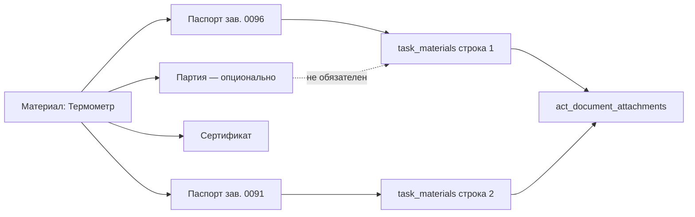
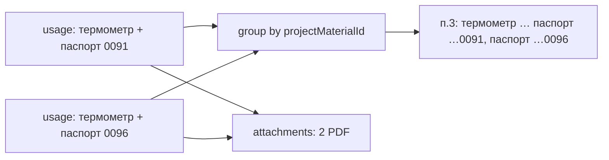

# План: Выбор документов качества для акта и приложений (уточнённый)

**Создан:** 2026-08-01  
**Обновлён:** 2026-08-01  
**Статус:** 🟡 Частично согласовано (D′ + п.3 + unique + дедуп doc); ждут Q5–Q7  
**Приоритет:** Высокий  
**Контекст прода:** акт №2 (`id=18`) — у термометра/манометра много паспортов на материал, в акт уходит один primary; у части docs нет PDF → `export-attachments` 422.

---

## Цель

Пользователь **сам выбирает**, какие документы качества (паспорт, сертификат, протокол и т.д.) попадают:
1. в текст п.3 АОСР (при необходимости),
2. в **приложения акта** (`act_document_attachments` → `export-attachments`).

Номер партии / поставки — **независимый** атрибут материала/строки. Он **не связывает и не ограничивает** набор документов качества в акте и приложениях.

---

## Уточнение от заказчика (обязательное)

> Наличие номера партии у материала никак не связывает и не ограничивает добавление документа качества в акт и в приложение к акту. Материал может иметь и сертификат, и паспорт, и номер партии — или что-то одно, или два.

### Следствия

| Было в первой редакции плана (отклонено) | Стало |
|---|---|
| Экземпляр = `material_batches` + паспорт 1:1 | Партия и документы качества — **ортогональные оси** |
| Чтобы добавить 2 паспорта, нужны 2 партии | Партии не требуются для multi-doc |
| Binding обязательно на `batchId` | Binding на материал достаточен; `batchId` у binding — опция, не условие |

---

## Проблема (as-is)

| Уровень | Поведение |
|---|---|
| Реестр | У материала может быть много docs (`passport`/`certificate`/…) и опционально партии |
| `task_materials` | Одна строка → один `qualityDocumentId`; UI скрывает материал после первого выбора |
| `resolveQualityDocumentId` | Автовыбор только primary / первого `useInActs` |
| `generate-acts` | В приложения попадает только этот один id на строку |
| Партия | Поле `batchId` есть, но **не должно** быть ключом к документам акта |

Итог: нельзя штатно положить в приложения и паспорт, и сертификат одного материала — или два разных паспорта термометра — без обхода через партию (что противоречит домену).

---

## Решение (to-be)

### Модель данных (концепт)

Три независимых факта:

```
project_material
├── optional batches[]          # партия/поставка — справочно, для учёта
├── bindings → documents[]      # паспорт / сертификат / протокол / … любые комбинации
└── использование в задаче/акте
    ├── optional batchId        # «из какой поставки» — если нужно
    └── selectedQualityDocIds[] # что пользователь хочет в акт/приложения
```

**Правило:** выбор документов для акта/приложений читается из явного выбора пользователя (или из multi-doc на строке), а **не** выводится из наличия/отсутствия партии.

### Рекомендуемая реализация MVP (предложение)

**Вариант D′ — несколько строк использования + независимые поля**  
(сохраняем идею «несколько вхождений», но **без** требования партий)

1. В задаче можно добавить **несколько строк** одного `projectMaterialId`.
2. У каждой строки:
   - `batchId` — optional, не влияет на доступность docs;
   - `qualityDocumentId` — один doc для этой строки (как сейчас в схеме).
3. Чтобы добавить паспорт + сертификат (или два паспорта) — две (N) строки одного материала с разными `qualityDocumentId`.
4. UI больше не прячет материал после первого добавления; при добавлении предлагается выбрать документ(ы) из bindings материала (role: quality/passport/protocol/certificate…).
5. `generate-acts` как сейчас: все строки → usages + unique doc ids → `act_document_attachments`.



### Альтернатива внутри того же продукта (если откажемся от multi-row)

**Вариант B′ — multi-select docs на одной строке**  
Одна строка материала + массив `qualityDocumentIds` / дочерняя таблица `task_material_documents`. Партия по-прежнему optional на строке.  
Плюс: меньше строк в п.3. Минус: миграция схемы, сложнее generate-acts и АОСР-текст.

> **Решение заказчика (2026-08-01):** идём по **D′ (multi-row)** с заделом на группировку текста п.3 (см. ниже). Вариант B′ / A+ в MVP не делаем; A+ можно рассмотреть позже как override приложений.

### П.3 АОСР — целевой текст (согласовано)

В хранилище — несколько строк usages одного материала (D′).  
В PDF п.3 строки **группируются по `projectMaterialId`**, документы перечисляются через запятую:

> при выполнении работ применены термометр бит-63 паспорт зав. №0091, паспорт зав. №0096.

Эталон для реализации (нормализовать регистр/пунктуацию по шаблону АОСР):

```
термометр БиТ-63 паспорт зав. №0091, паспорт зав. №0096
```

Правила группировки:

1. Группа = один `projectMaterialId` (имя материала один раз).
2. Внутри группы — уникальные `qualityDocumentId` в порядке `orderIndex` строк / первого появления.
3. Формат фрагмента документа: `{тип_строчными} зав. №{номер}` или по `docNumber` как в реестре (если номер уже содержит «Зав. №» — не дублировать префикс).
4. Несколько материалов — через точку с запятой или как принято в текущем `buildP3MaterialsText` / эталоне шаблона (сейчас numbered list — **заменить/дополнить** группированным прозаическим форматом для multi-doc групп).
5. Приложения (`act_document_attachments` / PDF-пакет) — **по-прежнему отдельные файлы** на каждый выбранный doc; группировка только в тексте п.3.

Сейчас `buildP3MaterialsText` делает отдельную нумерованную строку на каждый usage (`Материал: … — Документ: …`). Для D′ нужен рефакторинг: groupBy material → join docs.



### Unique constraint (согласовано — Q2 вариант 2)

**Было:** `UNIQUE (task_id, project_material_id, batch_id)` — партия в ключе, документ нет.  
**Станет:** `UNIQUE (task_id, project_material_id, quality_document_id)` — `batch_id` **вне** unique.

Следствия:
- Можно несколько строк одного материала с разными docs (в т.ч. без партий или с одной партией + паспорт и сертификат).
- Нельзя дважды добавить один и тот же `qualityDocumentId` к одному материалу в задаче.
- `quality_document_id` в таких строках для multi-doc должен быть **NOT NULL** (или partial unique `WHERE quality_document_id IS NOT NULL` + отдельное правило для строк без doc — по умолчанию multi-doc строки всегда с doc).
- Миграция: drop старого index → создать новый; проверить/почистить возможные дубли `(task, material, doc)` на проде перед уникальностью.

---

## Что снимаем из старого плана

- Авто-backfill «1 паспорт → 1 material_batch»
- Обязательный мастер «экземпляр = партия + паспорт»
- Правило 1:1 passport↔batch для участия в актах
- Задачи INST-002 в прежней формулировке (замена на опциональную нормализацию данных, не как блокер)

---

## Задачи (обновлённый бэклог)

### INST-001 — ADR с ортогональными осями
- **Статус**: Не начата
- **Шаги**:
  - [ ] Зафиксировать: партия ⟂ документы качества ⟂ выбор для акта
  - [x] Выбран **D′** + группировка п.3 (решение заказчика)
  - [x] Unique: `(task_id, project_material_id, quality_document_id)`, batch вне unique
  - [ ] ADR в `ai_docs/develop/architecture/`
  - [ ] Коротко обновить `docs/project.md`
- **Зависимости**: ответы Q5–Q7 (Q1–Q4 закрыты)

### INST-003 — Резолв и generate-acts без привязки к batch
- **Статус**: Не начата
- **Шаги**:
  - [ ] Fallback quality-doc по material bindings (как сейчас), `batchId` только как фильтр *если задан*, иначе не обязателен
  - [ ] При multi-row: в attachments — union всех `qualityDocumentId` строк
  - [ ] Тесты: два паспорта одного материала без партий; паспорт+сертификат; строка с batch и без — одинаково валидны
- **Зависимости**: INST-001

### INST-004 — Unique / API для нескольких строк одного материала
- **Статус**: Не начата
- **Шаги**:
  - [ ] Preflight: найти дубли `(task_id, project_material_id, quality_document_id)` в `task_materials`
  - [ ] Миграция: drop `task_materials_task_material_batch_uq` → create unique `(task_id, project_material_id, quality_document_id)` (имя например `task_materials_task_material_doc_uq`)
  - [ ] Обновить `shared/schema.ts`
  - [ ] API/storage: при replace ловить unique violation → 409 с понятным текстом
  - [ ] Опционально API «документы материала, пригодные для актов» (все quality-роли, не зависящие от batch)
- **Зависимости**: INST-001

### INST-005 — UI SelectTaskMaterials
- **Статус**: Не начата
- **Шаги**:
  - [ ] Не скрывать материал целиком после первого добавления
  - [ ] При добавлении: multi-select документов качества → создать **N строк** (D′), по одному `qualityDocumentId` на строку
  - [ ] Поле партии — отдельный optional control, не фильтрует список docs
  - [ ] В строке показывать тип+номер документа; бейдж «нет файла» если `fileUrl` пуст
  - [ ] Запрет дубля одного и того же `qualityDocumentId` в задаче (Q3): UI не даёт выбрать уже добавленный doc; сервер — 409
  - [ ] (UX) опционально визуально группировать строки одного материала в списке задачи
- **Зависимости**: INST-004

### INST-006 — Исходные данные (лёгкий)
- **Статус**: Не начата
- **Шаги**:
  - [ ] В карточке материала явно показать, что партия и документы независимы (копирайт/группировка UI)
  - [ ] Не требовать партию при привязке паспорта/сертификата
  - [ ] (Опционально) удобный multi-bind паспортов как сейчас — уже работает
- **Зависимости**: INST-001

### INST-007 — Акт / PDF / экспорт
- **Статус**: Не начата
- **Шаги**:
  - [ ] generate-acts → несколько attachments с одного материала
  - [ ] ActDetail: несколько строк / несколько docs видны
  - [ ] `buildP3MaterialsText`: groupBy `projectMaterialId`, текст вида `имя паспорт зав. №A, паспорт зав. №B` (см. «П.3 АОСР — целевой текст»)
  - [ ] Юнит-тест на группировку (2 паспорта термометра → одна фраза; второй материал не схлопывается)
  - [ ] export-attachments + предупреждение о missing file
- **Зависимости**: INST-003, INST-005

### INST-008 — Smoke на акте №2
- **Статус**: Не начата
- **Шаги**:
  - [ ] Выбрать 2 паспорта термометра (без создания партий)
  - [ ] При необходимости догрузить PDF
  - [ ] Перегенерация → export-attachments 200
- **Зависимости**: деплой INST-003…007

### INST-009 — Документация
- **Статус**: Не начата
- **Шаги**: changelog, tasktracker, project.md

---

## Критерии приёмки (MVP)

1. В задачу/акт можно включить **≥2 документа качества** одного материала (два паспорта или паспорт+сертификат) **без** обязательного номера партии.
2. Наличие или отсутствие партии **не мешает** выбору любого quality-doc материала.
3. Материал может иметь любую комбинацию: только паспорт / только сертификат / оба / плюс партия / без партии.
4. В `act_document_attachments` попадают именно выбранные пользователем документы (отдельные файлы).
5. В тексте п.3 один материал с двумя паспортами выглядит как одна фраза:  
   `термометр БиТ-63 паспорт зав. №0091, паспорт зав. №0096` (допускается естественная капитализация/префикс шаблона «при выполнении работ применены»).
6. Регресс: однодокументные материалы (как кран LD) работают как раньше.
7. Экспорт приложений атомарный; missing PDF — явная 422 по documentId.

---

## Вне scope MVP

- Автозалив всех `useInActs` без выбора.
- Складской серийный учёт, обязательный 1:1 серийник↔партия.
- Ослабление атомарности export-attachments.
- Полноценный ручной редактор приложений, полностью отвязанный от материалов (можно позже как override).

---

## Решения и открытые вопросы

### Закрыто

| # | Решение |
|---|---|
| **Q1** | **D′** — несколько строк материала, по одному `qualityDocumentId` на строку |
| **Q2** | Unique `(task_id, project_material_id, quality_document_id)`; `batch_id` вне unique |
| **Q3** | Один и тот же паспорт/`documentId` в задаче (и далее в акте) — **запретить** (UI + 409 + unique) |
| **Q4** | В п.3 материал пишется **один раз**, документы перечисляются: `… паспорт зав. №0091, паспорт зав. №0096`. В приложениях — отдельные PDF |

### Ещё открыто

### Q5. Где выбирать docs
- [ ] Только материалы задачи графика → generate-acts (рекомендация для MVP)
- [ ] + правка списка приложений в карточке акта

### Q6. Документы без файла
- [ ] Можно выбрать, экспорт потом упадёт с 422
- [ ] Warn в UI, выбор разрешён (рекомендация)
- [ ] Нельзя добавить без `fileUrl`

### Q7. Автовыбор при первом добавлении материала
- [ ] Как сейчас: подставить primary
- [ ] Сразу диалог multi-select (рекомендация; удобно отметить 0091+0096)
- [ ] Primary + предложить отметить все useInActs

### Q8. Точный шаблон фразы п.3
Заказчик привёл: «при выполнении работ применены термометр бит-63 паспорт зав. №0091, паспорт зав. №0096.»
- [ ] Префикс «при выполнении работ применены» уже в шаблоне АОСР — генератор отдаёт только хвост `материал + docs`
- [ ] Генератор собирает полную фразу целиком
- Нужно сверить с `server/templates/aosr/` при реализации (не блокер продукта)

---

## Связанные находки с прода (2026-08-01)

- Акт №2: термометр `doc 48`, манометр `doc 31` в attachments, оба без `fileUrl`.
- У материала термометра `#23`: 5 passport bindings на материал, **0 партий** — multi-doc должен работать именно в таком состоянии.
- У манометра `#22`: 17 passport bindings, партий не требуются для выбора подмножества в акт.
