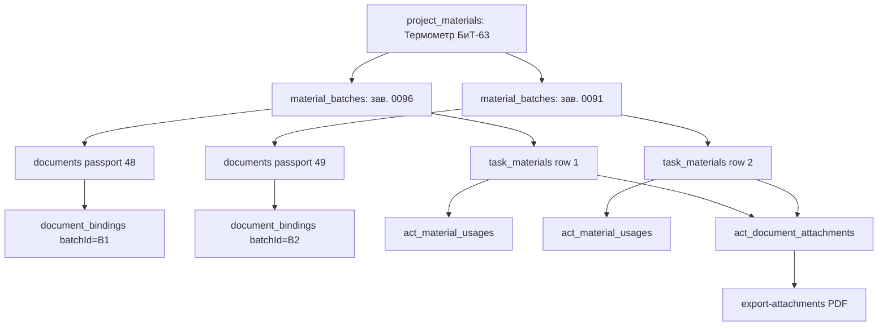

# План: Экземпляры материалов и документы качества в приложениях акта (вариант D)

**Создан:** 2026-08-01  
**Статус:** 🟡 Ожидает ответов на уточняющие вопросы  
**Приоритет:** Высокий  
**Контекст прода:** акт №2 (`id=18`, объект `6`) — термометр/манометр: много паспортов на материал, в акт попадает один primary; у выбранных паспортов часто нет PDF (`fileUrl=null`) → `export-attachments` = 422.

---

## Цель

Дать пользователю возможность включать в акт **несколько документов качества одного типа материала** (например, два паспорта термометра), моделируя каждый выбранный паспорт как **отдельную строку-экземпляр** (партия / зав. №), а не как multi-select документов на одной строке.

В приложения акта (`act_document_attachments`) попадают документы из выбранных экземпляров; экспорт PDF собирает все прикреплённые файлы.

---

## Проблема (as-is)

| Уровень | Поведение |
|---|---|
| `document_bindings` | Много паспортов на один `project_material` (термометр: 5, манометр: 17) |
| `task_materials` | Unique `(taskId, projectMaterialId, batchId)` + один `qualityDocumentId` → материал без партии нельзя добавить дважды |
| `resolveQualityDocumentId` | Берёт только `isPrimary` / первый `useInActs` |
| `generate-acts` | Одна строка материала → один doc в приложения |
| UI `SelectTaskMaterials` | Материал исчезает из списка после выбора; dropdown на один документ |
| `ActDetail` | Приложения только read-only |

Итог: «нужно 2 файла термометра» невозможно штатно, хотя реестр уже хранит несколько паспортов.

---

## Решение (to-be) — вариант D

### Суть

**Экземпляр** = строка `material_batches` (партия/зав. №) + ровно один quality-документ (passport/protocol/quality), привязанный к этой партии через `document_bindings.batchId`.

В задачу/акт добавляются **несколько строк** одного `projectMaterialId` с **разными `batchId`**. Каждая строка несёт свой `qualityDocumentId`. `generate-acts` копирует все строки → все выбранные документы попадают в `act_document_attachments`.

### Почему не ломаем текущую модель

- Уже есть `material_batches`, `document_bindings.batchId`, `task_materials.batchId`, unique по `(task, material, batch)`.
- Не нужен multi-value `qualityDocumentId` и не нужен отдельный редактор приложений как источник истины (вариант A) — приложения остаются производными от строк экземпляров при генерации.
- П.3 АОСР естественно показывает несколько строк одного материала с разными зав. № / паспортами.

### Допущения плана (требуют подтверждения — см. «Открытые вопросы»)

1. **Экземпляр = `material_batches`**, где `batchNumber` (или `notes`) хранит идентификатор экземпляра (зав. № / партия). Отдельная таблица `material_instances` в MVP **не** вводится.
2. На экземпляр — **один** основной quality-doc для актов (`isPrimary` на binding с `batchId`, либо единственный passport binding партии).
3. Пользователь **явно выбирает**, какие экземпляры добавить в задачу/акт (не автозалив всех 17 манометров).
4. Документы, привязанные только к материалу (`batchId IS NULL`), остаются валидны; для D их нужно либо привязать к партии, либо создать партии-обёртки (миграция/мастер).
5. `generate-acts` продолжает **полностью заменять** usages/attachments акта из `task_materials` (как сейчас). Ручной редактор приложений в акте — out of scope MVP D.
6. Загрузка отсутствующих PDF (`fileUrl`) — **смежная обязательная операция данных**, но отдельная подзадача (не блокер дизайна модели).

---

## Нефункциональные ограничения

- Не раздувать пакет: в акт попадают только **выбранные** экземпляры.
- Экспорт приложений остаётся атомарным: любой `missing`/`not_pdf` → 422 (поведение не ослабляем в рамках D).
- Unique `act_document_attachments (actId, documentId)` сохраняется.
- Telegram/mobile UX: выбор экземпляров должен быть работоспособен на узком экране.

---

## Задачи

### INST-001 — Продуктовые правила и ADR
- **Статус**: Не начата (ждёт ответов)
- **Описание**: Зафиксировать в `ai_docs/develop/architecture/` ADR: определение экземпляра, 1:1 batch↔passport для актов, выбор пользователя, поведение generate-acts, отображение в п.3 АОСР.
- **Шаги**:
  - [ ] Ответы на открытые вопросы (ниже)
  - [ ] ADR `ai_docs/develop/architecture/ADR-YYYY-act-material-instances.md`
  - [ ] Обновить `docs/project.md` (краткий абзац про экземпляры → приложения)
- **Зависимости**: ответы заказчика

### INST-002 — Данные: партии для существующих passport-bindings
- **Статус**: Не начата
- **Описание**: Для материалов вроде термометра/манометра, где N паспортов висят на материале без `batchId`, подготовить безопасный путь «1 passport → 1 batch».
- **Шаги**:
  - [ ] Инвентаризационный скрипт/SQL: материалы с >1 quality-binding и `batchId IS NULL`
  - [ ] Решить: авто-создание `material_batches` (batchNumber из `documents.docNumber`) + перенос binding на `batchId` **или** только UI-мастер «Создать экземпляры из паспортов»
  - [ ] Миграция/скрипт backfill (идемпотентный), без удаления документов
  - [ ] Не трогать bindings, уже привязанные к партиям
- **Зависимости**: INST-001 (особенно Q1–Q3)
- **Риск**: на проде термометр — 5 docs, манометр — 17; backfill должен быть обратимо описан

### INST-003 — Backend: резолв quality-doc с учётом batch
- **Статус**: Не начата
- **Описание**: `resolveQualityDocumentForMaterial(projectMaterialId, batchId?)` предпочитает bindings партии, иначе material-level; primary/useInActs как сейчас.
- **Шаги**:
  - [ ] Расширить `storage.resolveQualityDocumentForMaterial`
  - [ ] `generate-acts`: fallback с `batchId` строки `task_materials`
  - [ ] При сохранении `task_materials`: валидировать, что `qualityDocumentId` связан с материалом (и с batch, если указан)
  - [ ] Тесты: `tests/quality-document-resolution.test.ts`, flow с двумя batch одного материала
- **Зависимости**: INST-001

### INST-004 — API/контракты: добавление нескольких строк одного материала
- **Статус**: Не начата
- **Описание**: Убедиться, что `PUT/POST task_materials` и `replaceActMaterialUsages` корректно принимают несколько `(projectMaterialId, batchId)` без коллизий; понятные 409 при дубле `(task, material, batch)`.
- **Шаги**:
  - [ ] Проверить Zod в `shared/routes.ts`
  - [ ] Сообщения ошибок на русском для UI
  - [ ] Опционально: endpoint «доступные экземпляры материала» = batches + их quality docs (чтобы UI не собирал вручную)
- **Зависимости**: INST-003

### INST-005 — UI: выбор экземпляров в SelectTaskMaterials
- **Статус**: Не начата
- **Описание**: Главный UX входа для D.
- **Шаги**:
  - [ ] В диалоге добавления: после выбора материала показать **список экземпляров** (партия / зав. № / паспорт / есть ли файл)
  - [ ] Multi-select экземпляров → в задачу добавляется N строк с разными `batchId` и предзаполненным `qualityDocumentId`
  - [ ] Материал без партий: CTA «Создать экземпляр из паспорта» / «Добавить как раньше (1 doc)» — по решению Q4
  - [ ] Убрать/ослабить фильтр «материал уже выбран → скрыть»: скрывать только полностью исчерпанные (все экземпляры уже в задаче) либо всегда показывать материал с оставшимися экземплярами
  - [ ] В карточке строки показывать зав. № и паспорт, а не сырой batchId
  - [ ] Сохранение через существующий replace task materials
- **Файлы**: `client/src/pages/SelectTaskMaterials.tsx`, хуки материалов/партий
- **Зависимости**: INST-002, INST-004

### INST-006 — UI исходных данных: мастер «экземпляр = партия + паспорт»
- **Статус**: Не начата
- **Описание**: В карточке материала упростить создание связки партия↔паспорт (сейчас разрозненно).
- **Шаги**:
  - [ ] На `/source/materials/:id`: действие «Добавить экземпляр» (batchNumber/docNumber, опционально quantity=1, загрузка PDF)
  - [ ] Создаёт `material_batches` + `documents` (или bind существующего) + `document_bindings` с `batchId`, `bindingRole=passport`, `useInActs=true`
  - [ ] Пометить primary: либо первый, либо явно выбранный
- **Зависимости**: INST-001, INST-002
- **Приоритет**: высокий для новых данных; для текущего прода можно начать с backfill

### INST-007 — Акт / PDF / экспорт
- **Статус**: Не начата
- **Описание**: Убедиться, что цепочка до PDF работает для N экземпляров.
- **Шаги**:
  - [ ] `generate-acts`: N строк термометра → N usages + N attachments (dedupe по documentId)
  - [ ] `ActDetail`: в «Материалы» видно несколько строк одного имени с разными паспортами; в «Документы» — все приложения
  - [ ] Текст п.3 АОСР (`buildP3MaterialsText`) корректно перечисляет строки (не схлопывает в одну)
  - [ ] `export-attachments`: успех только если у всех выбранных есть PDF; UI показывает какие экземпляры без файла
  - [ ] Регресс-тесты: `act-material-quality-flow`, `act-attachments-pdf`
- **Зависимости**: INST-003, INST-005

### INST-008 — Прод-данные объекта «Росреестр» (smoke)
- **Статус**: Не начата
- **Описание**: Практический прогон на акте №2 после деплоя.
- **Шаги**:
  - [ ] Создать/backfill экземпляры для термометра (минимум 2 с PDF) и выборочно манометра
  - [ ] Загрузить недостающие PDF для выбранных documentId
  - [ ] В задаче работы «Установка термометров…» выбрать 2 экземпляра
  - [ ] Перегенерировать акты → акт №2 содержит 2 thermometer attachments
  - [ ] `POST /api/acts/18/export-attachments` → 200
- **Зависимости**: INST-002…007 + деплой

### INST-009 — Документация и трекер
- **Статус**: Не начата
- **Шаги**:
  - [ ] `docs/changelog.md`, `docs/tasktracker.md`, при необходимости `docs/auth-guide` не трогать
  - [ ] Краткая user-facing заметка в roadmap/исходные данные: «один паспорт на экземпляр (партию)»
- **Зависимости**: после реализации

---

## Критерии приёмки (MVP)

1. К одному виду работ/задаче можно добавить **≥2 строки** одного материала с разными партиями/зав. №.
2. У каждой строки свой паспорт; оба попадают в `act_document_attachments` после `generate-acts`.
3. Пользователь **не обязан** тянуть все 17 паспортов манометра — только выбранные экземпляры.
4. Повторно добавить тот же экземпляр в ту же задачу нельзя (unique / понятная ошибка).
5. Экспорт приложений включает PDF всех выбранных экземпляров с файлами; без файла — явная ошибка по `documentId`.
6. Регресс: материалы с одним паспортом (как кран LD) работают как раньше.

---

## Вне scope MVP D

- Ручной редактор приложений акта, независимый от материалов (вариант A) — можно позже как override.
- Автоматическое включение всех `useInActs` без выбора (вариант C).
- Полноценный складской учёт серийников, списание количества, сканер штрихкодов.
- Ослабление атомарности `export-attachments` (частичный PDF).
- Глобальные документы с внешним URL как приложения (по-прежнему `unsupported_url`).

---

## Риски

| Риск | Митигация |
|---|---|
| 17 манометров → шум в UI | Только явный выбор экземпляров; поиск по зав. № |
| Backfill сломает текущие primary-bindings | Идемпотентный скрипт + dry-run; primary сохранять |
| `batchId NULL` в unique index (PostgreSQL: NULL ≠ NULL) может дать дубли «без партии» | В D запретить вторую строку без batch; для multi требовать batch |
| Нет PDF → экспорт всё равно 422 | В UI бейдж «нет файла»; блок на выбор или явный warn |
| П.3 АОСР станет длинным | Норма для D; при необходимости группировка в PDF позже |

---

## Порядок внедрения

1. Ответы на вопросы → INST-001 ADR  
2. INST-003 + тесты резолва  
3. INST-002 backfill/мастер экземпляров  
4. INST-004/005 UI выбора в задаче  
5. INST-006 (можно параллельно с 005)  
6. INST-007 акт/PDF  
7. INST-008 smoke на проде  
8. INST-009 документация  

---

## Открытые вопросы (блокеры перед кодом)

### Q1. Идентичность экземпляра
Достаточно ли считать экземпляром существующую `material_batches` (`batchNumber` = зав. № из паспорта), **без** новой таблицы?

- [ ] Да, только `material_batches`
- [ ] Нет, нужна отдельная сущность `material_instances`

### Q2. Связь паспорт ↔ партия
Обязателен ли 1:1 (один passport-binding на партию) для участия в актах?

- [ ] Да, строго 1:1
- [ ] Нет, на партии может быть несколько docs; в строку задачи всё равно выбирается один

### Q3. Миграция текущих данных (термометр ×5, манометр ×17)
Как обработать passport-bindings с `batchId IS NULL`?

- [ ] Авто-backfill: создать партию на каждый паспорт, перенести binding на batch
- [ ] Только ручной мастер в UI, без авто-миграции
- [ ] Гибрид: скрипт по кнопке «Разбить на экземпляры» на карточке материала

### Q4. Материал без партий в задаче
Если партий ещё нет — что показать при добавлении материала в задачу?

- [ ] Старый путь: одна строка + выбор одного doc с материала
- [ ] Обязать сначала создать экземпляры
- [ ] Визард «выбери паспорта → создадим партии и строки» прямо из SelectTaskMaterials

### Q5. Сколько экземпляров выбирать относительно объёма работы
Работа «термометры» = 4 компл., паспортов 5. Нужна ли валидация «число выбранных экземпляров = quantity»?

- [ ] Нет, только ручной выбор (рекомендация плана)
- [ ] Мягкое предупреждение
- [ ] Жёсткий запрет save/generate при несоответствии

### Q6. Отображение в п.3 АОСР
Несколько строк одного материала в PDF:

- [ ] Отдельная строка на экземпляр (зав. № + реквизиты паспорта)
- [ ] Одна строка материала + перечень паспортов в ячейке документа
- [ ] Как получится из текущих usages без спец-форматирования (потом улучшим)

### Q7. Primary на материале vs на партии
Сейчас у термометра `documentId=48` — `isPrimary` на material-level. После split:

- [ ] Primary только на batch-bindings; material-level primary сбросить
- [ ] Оставить material-level primary как fallback, если строка без batch

### Q8. Загрузка PDF в рамках этой фичи
На проде у паспортов термометра/манометра нет файлов.

- [ ] В scope D: обязательный upload в мастере экземпляра
- [ ] Вне scope: модель/UI выбора отдельно, файлы догружает пользователь как сейчас
- [ ] Блокировать добавление экземпляра в акт без `fileUrl`

### Q9. Нужен ли выбор/правка экземпляров прямо в карточке акта
Или только через график → материалы задачи → generate-acts?

- [ ] Только через график (меньше scope)
- [ ] В акте тоже можно добавить/убрать экземпляр (фактически кусок варианта A)

### Q10. Объект и роли
Фича для всех владельцев объектов или только admin? (по умолчанию — как текущие task materials: любой пользователь с доступом к объекту)

---

## Связанные находки с прода (2026-08-01)

- Акт №2 `id=18`: usages уже содержат термометр `qualityDocumentId=48` и манометр `31`, но `fileUrl=null`.
- `POST /api/acts/18/export-attachments` → 422 `missing` для `48` и `31`.
- У материала термометра `#23` пять passport bindings, все `useInActs=true`, primary = `48`.
- Партий (`batches`) у материала `#23` сейчас **0** — без INST-002/004 multi-row через batch невозможен.
