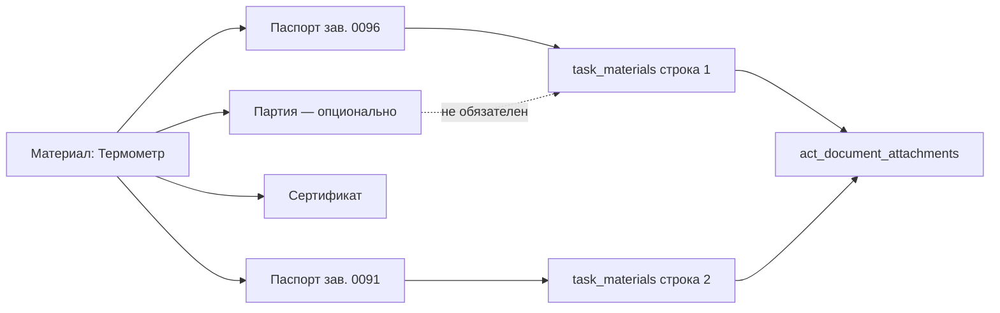

# План: Выбор документов качества для акта и приложений (уточнённый)

**Создан:** 2026-08-01  
**Обновлён:** 2026-08-01  
**Статус:** 🟡 Ожидает ответов на уточняющие вопросы (после корректировки модели)  
**Приоритет:** Высокий  
**Контекст прода:** акт №2 (`id=18`) — у термометра/манометра много паспортов на материал, в акт уходит один primary; у части docs нет PDF → `export-attachments` 422.

---

## Цель

Пользователь **сам выбирает**, какие документы качества (паспорт, сертификат, протокол и т.д.) попадают:
1. в текст п.3 АОСР (при необходимости),
2. в **приложения акта** (`act_document_attachments` → `export-attachments`).

Номер партии / поставки — **независимый** атрибут материала/строки. Он **не связывает и не ограничивает** набор документов качества в акте и приложениях.

---

## Уточнение от заказчика (обязательное)

> Наличие номера партии у материала никак не связывает и не ограничивает добавление документа качества в акт и в приложение к акту. Материал может иметь и сертификат, и паспорт, и номер партии — или что-то одно, или два.

### Следствия

| Было в первой редакции плана (отклонено) | Стало |
|---|---|
| Экземпляр = `material_batches` + паспорт 1:1 | Партия и документы качества — **ортогональные оси** |
| Чтобы добавить 2 паспорта, нужны 2 партии | Партии не требуются для multi-doc |
| Binding обязательно на `batchId` | Binding на материал достаточен; `batchId` у binding — опция, не условие |

---

## Проблема (as-is)

| Уровень | Поведение |
|---|---|
| Реестр | У материала может быть много docs (`passport`/`certificate`/…) и опционально партии |
| `task_materials` | Одна строка → один `qualityDocumentId`; UI скрывает материал после первого выбора |
| `resolveQualityDocumentId` | Автовыбор только primary / первого `useInActs` |
| `generate-acts` | В приложения попадает только этот один id на строку |
| Партия | Поле `batchId` есть, но **не должно** быть ключом к документам акта |

Итог: нельзя штатно положить в приложения и паспорт, и сертификат одного материала — или два разных паспорта термометра — без обхода через партию (что противоречит домену).

---

## Решение (to-be)

### Модель данных (концепт)

Три независимых факта:

```
project_material
├── optional batches[]          # партия/поставка — справочно, для учёта
├── bindings → documents[]      # паспорт / сертификат / протокол / … любые комбинации
└── использование в задаче/акте
    ├── optional batchId        # «из какой поставки» — если нужно
    └── selectedQualityDocIds[] # что пользователь хочет в акт/приложения
```

**Правило:** выбор документов для акта/приложений читается из явного выбора пользователя (или из multi-doc на строке), а **не** выводится из наличия/отсутствия партии.

### Рекомендуемая реализация MVP (предложение)

**Вариант D′ — несколько строк использования + независимые поля**  
(сохраняем идею «несколько вхождений», но **без** требования партий)

1. В задаче можно добавить **несколько строк** одного `projectMaterialId`.
2. У каждой строки:
   - `batchId` — optional, не влияет на доступность docs;
   - `qualityDocumentId` — один doc для этой строки (как сейчас в схеме).
3. Чтобы добавить паспорт + сертификат (или два паспорта) — две (N) строки одного материала с разными `qualityDocumentId`.
4. UI больше не прячет материал после первого добавления; при добавлении предлагается выбрать документ(ы) из bindings материала (role: quality/passport/protocol/certificate…).
5. `generate-acts` как сейчас: все строки → usages + unique doc ids → `act_document_attachments`.



### Альтернатива внутри того же продукта (если откажемся от multi-row)

**Вариант B′ — multi-select docs на одной строке**  
Одна строка материала + массив `qualityDocumentIds` / дочерняя таблица `task_material_documents`. Партия по-прежнему optional на строке.  
Плюс: меньше строк в п.3. Минус: миграция схемы, сложнее generate-acts и АОСР-текст.

> По умолчанию в плане заложен **D′ (multi-row)** — меньше изменений схемы, партия остаётся независимым полем. Нужно подтверждение (Q1 ниже).

### Unique constraint

Сейчас: `UNIQUE (task_id, project_material_id, batch_id)`.

- При `batch_id NULL` PostgreSQL обычно **позволяет** несколько строк (NULL ≠ NULL в unique).
- Блокер сейчас в основном **UI** (`selectedIds` по `projectMaterialId`).
- Если оба раза указана **одна и та же** партия — unique ударит. Для D′ это ок: либо разные batch, либо без batch, либо ослабить unique до чего-то вроде `(task, material, batch, quality_document)` — решить в Q2.

---

## Что снимаем из старого плана

- Авто-backfill «1 паспорт → 1 material_batch»
- Обязательный мастер «экземпляр = партия + паспорт»
- Правило 1:1 passport↔batch для участия в актах
- Задачи INST-002 в прежней формулировке (замена на опциональную нормализацию данных, не как блокер)

---

## Задачи (обновлённый бэклог)

### INST-001 — ADR с ортогональными осями
- **Статус**: Не начата
- **Шаги**:
  - [ ] Зафиксировать: партия ⟂ документы качества ⟂ выбор для акта
  - [ ] Выбрать D′ vs B′ (Q1)
  - [ ] ADR в `ai_docs/develop/architecture/`
  - [ ] Коротко обновить `docs/project.md`
- **Зависимости**: ответы Q1–Q6

### INST-003 — Резолв и generate-acts без привязки к batch
- **Статус**: Не начата
- **Шаги**:
  - [ ] Fallback quality-doc по material bindings (как сейчас), `batchId` только как фильтр *если задан*, иначе не обязателен
  - [ ] При multi-row: в attachments — union всех `qualityDocumentId` строк
  - [ ] Тесты: два паспорта одного материала без партий; паспорт+сертификат; строка с batch и без — одинаково валидны
- **Зависимости**: INST-001

### INST-004 — Unique / API для нескольких строк одного материала
- **Статус**: Не начата
- **Шаги**:
  - [ ] Проверить фактическое поведение unique с `batch_id NULL`
  - [ ] При необходимости миграция unique → включить `quality_document_id` или partial unique
  - [ ] Понятные 409 при реальном дубле
  - [ ] Опционально API «документы материала, пригодные для актов» (все quality-роли, не зависящие от batch)
- **Зависимости**: INST-001

### INST-005 — UI SelectTaskMaterials
- **Статус**: Не начата
- **Шаги**:
  - [ ] Не скрывать материал целиком после первого добавления
  - [ ] При добавлении: выбрать один или несколько документов качества → создать N строк (D′) **или** одну строку с multi-select (B′)
  - [ ] Поле партии — отдельный optional control, не фильтрует список docs
  - [ ] В строке показывать тип+номер документа; бейдж «нет файла» если `fileUrl` пуст
  - [ ] Запрет дубля одной и той же пары (material + document) в задаче — по Q3
- **Зависимости**: INST-004

### INST-006 — Исходные данные (лёгкий)
- **Статус**: Не начата
- **Шаги**:
  - [ ] В карточке материала явно показать, что партия и документы независимы (копирайт/группировка UI)
  - [ ] Не требовать партию при привязке паспорта/сертификата
  - [ ] (Опционально) удобный multi-bind паспортов как сейчас — уже работает
- **Зависимости**: INST-001

### INST-007 — Акт / PDF / экспорт
- **Статус**: Не начата
- **Шаги**:
  - [ ] generate-acts → несколько attachments с одного материала
  - [ ] ActDetail: несколько строк / несколько docs видны
  - [ ] П.3 АОСР: согласовать формат (Q4)
  - [ ] export-attachments + предупреждение о missing file
- **Зависимости**: INST-003, INST-005

### INST-008 — Smoke на акте №2
- **Статус**: Не начата
- **Шаги**:
  - [ ] Выбрать 2 паспорта термометра (без создания партий)
  - [ ] При необходимости догрузить PDF
  - [ ] Перегенерация → export-attachments 200
- **Зависимости**: деплой INST-003…007

### INST-009 — Документация
- **Статус**: Не начата
- **Шаги**: changelog, tasktracker, project.md

---

## Критерии приёмки (MVP)

1. В задачу/акт можно включить **≥2 документа качества** одного материала (два паспорта или паспорт+сертификат) **без** обязательного номера партии.
2. Наличие или отсутствие партии **не мешает** выбору любого quality-doc материала.
3. Материал может иметь любую комбинацию: только паспорт / только сертификат / оба / плюс партия / без партии.
4. В `act_document_attachments` попадают именно выбранные пользователем документы.
5. Регресс: однодокументные материалы (как кран LD) работают как раньше.
6. Экспорт приложений атомарный; missing PDF — явная 422 по documentId.

---

## Вне scope MVP

- Автозалив всех `useInActs` без выбора.
- Складской серийный учёт, обязательный 1:1 серийник↔партия.
- Ослабление атомарности export-attachments.
- Полноценный ручной редактор приложений, полностью отвязанный от материалов (можно позже как override).

---

## Открытые вопросы

### Q1. Форма выбора нескольких docs
- [ ] **D′** несколько строк материала (по одному `qualityDocumentId` на строку) — меньше схемы
- [ ] **B′** одна строка + multi-select документов (новая связь task↔docs)
- [ ] **A+** редактор приложений в карточке акта (источник истины attachments), материалы отдельно

### Q2. Unique в БД
Если две строки одного материала без партии (или с одной партией) и разными docs:
- [ ] Оставить unique как есть (полагаемся на NULL-семантику PG) + запрет дублей в приложении
- [ ] Новая уникальность: `(task_id, project_material_id, quality_document_id)` (batch вне unique)
- [ ] Убрать unique, дедуп только в UI/сервисе

### Q3. Можно ли дважды добавить один и тот же documentId к задаче/акту?
- [ ] Нет, дедуп (рекомендация)
- [ ] Да, если нужны две строки в п.3 с одним doc (маловероятно)

### Q4. П.3 АОСР при нескольких docs одного материала
- [ ] Отдельная строка на каждый выбранный doc
- [ ] Одна строка материала, в графе документа — перечень через `;` / перевод строки
- [ ] В п.3 только «основной» doc, остальные только в PDF-приложениях

### Q5. Где выбирать docs
- [ ] Только материалы задачи графика → generate-acts
- [ ] + правка списка приложений в карточке акта

### Q6. Документы без файла
- [ ] Можно выбрать, экспорт потом упадёт с 422 (как сейчас)
- [ ] Warn в UI, выбор разрешён
- [ ] Нельзя добавить в задачу/приложения без `fileUrl`

### Q7. Автовыбор при первом добавлении материала
- [ ] Как сейчас: подставить primary, пользователь добавит остальные вручную
- [ ] Сразу диалог multi-select без автоподстановки
- [ ] Primary в п.3, а в приложения предложить отметить все useInActs (галочки)

---

## Рекомендации плана (если «бери по умолчанию»)

| # | Рекомендация |
|---|---|
| Q1 | **D′** multi-row |
| Q2 | Unique → `(task_id, project_material_id, quality_document_id)` , `batch_id` не в unique |
| Q3 | Дедуп documentId |
| Q4 | Отдельная строка на doc **или** перечень в ячейке — предпочтительно перечень, если строк много (манометр×N); уточнить |
| Q5 | Только график в MVP |
| Q6 | Warn + разрешить выбор |
| Q7 | Диалог multi-select при добавлении |

---

## Связанные находки с прода (2026-08-01)

- Акт №2: термометр `doc 48`, манометр `doc 31` в attachments, оба без `fileUrl`.
- У материала термометра `#23`: 5 passport bindings на материал, **0 партий** — multi-doc должен работать именно в таком состоянии.
- У манометра `#22`: 17 passport bindings, партий не требуются для выбора подмножества в акт.
