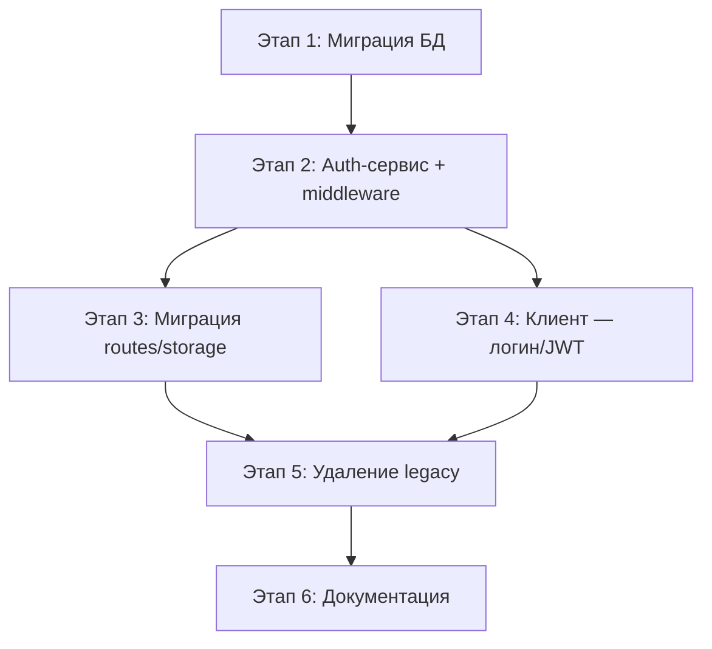

# Tasktracker 2 — Мультипровайдерная аутентификация

> **Цель**: отвязать систему от единственного провайдера (Telegram), чтобы пользователи не потеряли доступ к данным при недоступности Telegram. Ввести внутреннего пользователя (`users`) и поддержку нескольких способов входа (Telegram, email/пароль, и далее — телефон, OAuth).

> **Статус**: ✅ Завершена (2026-03-01)  
> **Приоритет**: Высокий (архитектурная устойчивость)  
> **Фактический объём**: ~47 файлов изменено, 2 SQL-миграции, 5280 строк добавлено

---

## Текущее состояние (проблемы)

| Место в коде | Зависимость от Telegram |
|---|---|
| `objects.telegram_user_id` (bigint) | Владелец объекта = Telegram ID |
| `admin_users.telegram_user_id` (text) | Администратор = Telegram ID |
| `messages.user_id` (text) | Автор сообщения = строка Telegram ID |
| `server/middleware/telegramAuth.ts` | Единственный способ "настоящей" аутентификации |
| `server/middleware/browserTokenAuth.ts` | Dev-only фолбэк (общий токен, не привязан к пользователю) |
| `server/routes.ts` (`req.telegramUser.id`) | ~30 использований, все привязаны к Telegram |
| `client/src/lib/queryClient.ts` | Шлёт `X-Telegram-Init-Data` или `X-App-Access-Token` |
| `client/src/pages/Login.tsx` | Только ввод общего dev-токена |

**Риски текущей архитектуры:**
- Telegram заблокирован/недоступен → пользователи полностью отрезаны
- Пользователь удалил Telegram → данные-"сироты" без владельца
- Dev-токен (`APP_ACCESS_TOKEN`) — общий для всех, не годится для прода
- Нет возможности web-логина без Telegram
- `telegramUserId` используется как bigint в `objects` и как text в `admin_users`/`messages` — несогласованность типов

---

## Целевая архитектура

### Новая модель данных

```
┌──────────────────────┐       ┌───────────────────────────┐
│       users           │       │     auth_providers         │
│───────────────────────│       │────────────────────────────│
│ id (PK, serial)       │◄─────┐│ id (PK, serial)           │
│ displayName (text)    │      ││ user_id (FK → users.id)   │
│ email (text, unique,  │      ││ provider (text, NOT NULL)  │
│   nullable)           │      ││   'telegram'|'email'|     │
│ passwordHash (text,   │      ││   'phone'|'google'...     │
│   nullable)           │      ││ external_id (text)        │
│ role ('user'|'admin') │      ││ metadata (jsonb)          │
│ is_blocked (bool)     │      ││ created_at (timestamp)    │
│ created_at (timestamp)│      │└───────────────────────────┘
│ last_login_at         │      │  UNIQUE(provider, external_id)
│   (timestamp)         │      │
└───────────────────────┘      │
         │                     │
    FK references:             │
    ├─ objects.user_id ────────┘
    ├─ messages.user_id
    ├─ acts.user_id (если нужно)
    └─ (admin_users — удалить, role в users)
```

### Принципы

1. **`users.id`** — единственный идентификатор пользователя во всех доменных таблицах
2. **`auth_providers`** — слой "как пользователь вошёл" (Telegram, email, телефон)
3. **JWT-токен** (или express-session) — после аутентификации по любому провайдеру клиент получает токен, который привязан к `users.id`
4. **Обратная совместимость**: Telegram MiniApp продолжает работать как основной способ входа
5. **Миграция данных**: существующие `telegramUserId` автоматически превращаются в записи `users` + `auth_providers`

---

## Этапы реализации

---

### Этап 1: Миграция БД — таблицы `users` и `auth_providers`
- **Статус**: ✅ Завершена
- **Файлы**: `shared/schema.ts`, `migrations/0018_users_auth_providers.sql`

#### Шаги:
- [x] 1.1. Добавить в `shared/schema.ts` таблицу `users`:
  ```
  id, displayName, email (unique nullable), passwordHash (nullable),
  role ('user'|'admin'), isBlocked, createdAt, lastLoginAt
  ```
- [x] 1.2. Добавить таблицу `auth_providers`:
  ```
  id, userId (FK → users.id ON DELETE CASCADE),
  provider ('telegram'|'email'|'phone'),
  externalId (text), metadata (jsonb), createdAt
  UNIQUE(provider, externalId)
  ```
- [x] 1.3. Добавить колонку `objects.user_id` (integer, FK → users.id, nullable на время миграции)
- [x] 1.4. Написать SQL-миграцию `0018_users_auth_providers.sql`:
  - CREATE TABLE users
  - CREATE TABLE auth_providers
  - ALTER TABLE objects ADD COLUMN user_id
  - Миграция данных: для каждого уникального `objects.telegram_user_id`:
    - INSERT INTO users (displayName, role, isBlocked) 
    - INSERT INTO auth_providers (userId, provider='telegram', externalId=telegram_user_id)
    - UPDATE objects SET user_id = <new users.id>
  - Миграция админов: для каждого `admin_users.telegram_user_id`:
    - Если уже есть user с таким telegram ID → UPDATE users SET role = 'admin'
    - Если нет → INSERT INTO users + auth_providers + SET role = 'admin'
  - Миграция `messages.user_id` (text с telegram ID): добавить `messages.internal_user_id` (integer FK), заполнить через JOIN с auth_providers
- [x] 1.5. Протестировать миграцию на копии БД

#### Результат этапа:
- Таблицы `users` и `auth_providers` существуют и заполнены
- Старые колонки (`objects.telegram_user_id`, `admin_users`) пока НЕ удалены (обратная совместимость)
- `objects.user_id` заполнен для всех существующих объектов

---

### Этап 2: Серверный auth-слой — провайдер-агностичный
- **Статус**: ✅ Завершена
- **Файлы**: `server/middleware/auth.ts` (новый), `server/middleware/telegramAuth.ts` (рефакторинг), `server/middleware/browserTokenAuth.ts` (рефакторинг), `server/auth-service.ts` (новый)

#### Шаги:
- [x] 2.1. Создать `server/auth-service.ts` — сервис аутентификации:
  ```
  findOrCreateUserByProvider(provider, externalId, metadata) → User
  findUserByEmail(email) → User | null
  verifyPassword(user, password) → boolean
  hashPassword(plaintext) → string
  generateJWT(user) → string
  verifyJWT(token) → { userId, role } | null
  linkProvider(userId, provider, externalId, metadata) → void
  ```
- [x] 2.2. Создать `server/middleware/auth.ts` — новый middleware:
  - Извлекает токен из:
    1. `Authorization: Bearer <jwt>` (приоритет)
    2. `X-Telegram-Init-Data` (автоматический логин через Telegram)
    3. `X-App-Access-Token` (dev-only, deprecated)
  - При JWT: verify → `req.user = { id, role, ... }`
  - При Telegram initData: validate HMAC → findOrCreateUser → `req.user = { id, role, ... }`
  - При access-token: legacy-совместимость
  - Результат: `req.user.id` (внутренний ID) вместо `req.telegramUser.id`
- [x] 2.3. Добавить зависимость `jsonwebtoken` (или использовать `jose` — встроенная в Node 20+):
  - Оценить: `jose` не требует нативных зависимостей, работает с ESM
  - JWT payload: `{ sub: users.id, role: users.role, iat, exp }`
  - JWT secret: новая env `JWT_SECRET` (обязательна в production)
  - TTL: 7 дней (настраиваемый)
- [x] 2.4. Обновить `telegramAuth.ts`:
  - Оставить валидацию HMAC
  - Добавить проверку `auth_date` (reject если старше 10 минут — защита от replay)
  - Вместо `req.telegramUser` → вызывать `authService.findOrCreateUserByProvider('telegram', ...)`
  - Результат → `req.user` (тот же интерфейс, что и JWT)
- [x] 2.5. Создать API аутентификации:
  - `POST /api/auth/login/telegram` — принимает initData, возвращает JWT + user
  - `POST /api/auth/register` — email + password, создаёт user + auth_provider('email')
  - `POST /api/auth/login` — email + password, возвращает JWT + user
  - `POST /api/auth/link-email` — привязка email с хешированием на сервере (вместо link-provider)
  - `GET /api/auth/me` — текущий пользователь по JWT
- [x] 2.6. Определить типы:
  ```typescript
  // В shared/routes.ts или shared/auth.ts
  interface AppUser {
    id: number;           // users.id (внутренний)
    displayName: string;
    email: string | null;
    role: 'user' | 'admin';
  }
  
  // Расширение Express Request
  declare global {
    namespace Express {
      interface Request {
        user?: AppUser;  // заменяет req.telegramUser
      }
    }
  }
  ```

#### Результат этапа:
- Единый `req.user.id` (internal) для всех провайдеров
- JWT выдаётся после любого успешного входа
- Telegram initData автоматически создаёт пользователя при первом входе
- Email/password — альтернативный вход

---

### Этап 3: Миграция серверных роутов и storage на `users.id`
- **Статус**: ✅ Завершена
- **Файлы**: `server/routes.ts`, `server/storage.ts`

#### Шаги:
- [x] 3.1. Заменить все `req.telegramUser?.id` на `req.user?.id` в `server/routes.ts` (~30 мест):
  - `GET /api/object/current` — `storage.getOrCreateDefaultObject(req.user.id)` (вместо telegramUserId)
  - `GET/POST/DELETE messages` — `userId = req.user.id` (integer)
  - `DELETE /api/works`, `DELETE /api/estimates/:id`, `DELETE /api/work-collections/:id` — `clearMessages(req.user.id)`
  - `POST /api/messages/:id/process`, `PATCH /api/messages/:id` — проверка владельца по `req.user.id`
  - `GET /api/worklog/section3` — фильтрация по `req.user.id`
- [x] 3.2. Обновить `IStorage` и `DatabaseStorage`:
  - `getOrCreateDefaultObject(userId: number)` — искать по `objects.user_id` (новая колонка) вместо `objects.telegram_user_id`
  - `getMessages(userId: number)` — фильтр по внутреннему ID (через `messages.internal_user_id`)
  - `clearMessages(userId: number)` — аналогично
- [x] 3.3. Обновить `adminAuth.ts`:
  - `req.user?.role === 'admin'` вместо поиска в `admin_users`
- [x] 3.4. Обновить admin storage (`adminStorage`):
  - `listUsers()` — JOIN с `users` вместо `objects.telegram_user_id`
  - `blockUser/unblockUser` — по `users.id`
  - `makeAdmin/removeAdmin` — по `users.id` (UPDATE users SET role)
  - `isAdmin` — по `users.id`
- [x] 3.5. Обновить `appAuth` middleware chain:
  ```typescript
  // Было:
  const appAuth = [browserTokenAuth, telegramAuthOptional, requireAuth];
  
  // Стало:
  const appAuth = authMiddleware({ required: true });
  ```

#### Результат этапа:
- Весь backend работает через `users.id`
- Telegram — один из провайдеров, а не единственный
- Admin-проверка через `users.role`, а не через отдельную таблицу

---

### Этап 4: Клиент — логин/регистрация + JWT
- **Статус**: ✅ Завершена
- **Файлы**: `client/src/lib/queryClient.ts`, `client/src/lib/auth.ts` (новый), `client/src/pages/Login.tsx` (переработка), `client/src/pages/Register.tsx` (новый), `client/src/hooks/use-auth.ts` (новый)

#### Шаги:
- [x] 4.1. Создать `client/src/lib/auth.ts` — управление токеном:
  ```
  getAuthToken(): string | null       // JWT из localStorage
  setAuthToken(jwt: string): void
  clearAuthToken(): void
  isAuthenticated(): boolean
  ```
- [x] 4.2. Обновить `client/src/lib/queryClient.ts`:
  - `createHeaders()` — отправлять `Authorization: Bearer <jwt>` (приоритет)
  - Если JWT нет и есть Telegram initData → отправить для автологина
  - Убрать `X-App-Access-Token` (deprecated)
- [x] 4.3. Создать хук `client/src/hooks/use-auth.ts`:
  ```
  useAuth() → { user, isLoading, isAuthenticated, login, register, logout, linkTelegram }
  ```
  - `login(email, password)` → `POST /api/auth/login` → сохранить JWT
  - `register(name, email, password)` → `POST /api/auth/register` → сохранить JWT
  - При запуске: если Telegram initData есть → `POST /api/auth/login/telegram` → сохранить JWT
  - `logout()` → очистить JWT, redirect на `/login`
- [x] 4.4. Переработать `client/src/pages/Login.tsx`:
  - Два режима: "Вход через Telegram" (автоматический в MiniApp) и "Вход по email"
  - Форма: email + пароль + кнопка "Войти"
  - Ссылка на регистрацию
  - Если внутри Telegram → автовход, форма не показывается
- [x] 4.5. Создать `client/src/pages/Register.tsx`:
  - Форма: имя + email + пароль + подтверждение пароля
  - Валидация: email формат, пароль >= 8 символов
  - После регистрации → автологин → redirect на `/`
- [x] 4.6. Добавить "Привязка email" в настройки (`Settings`):
  - Если пользователь вошёл через Telegram, но email не привязан → показать форму
  - `POST /api/auth/link-email` с хешированием пароля на сервере
  - Это "страховка" на случай недоступности Telegram
- [x] 4.7. Auth guard (защита роутов):
  - Если `!isAuthenticated()` → redirect на `/login`
  - Компонент `<AuthGuard>` реализован и интегрирован в `App.tsx`

#### Результат этапа:
- Пользователь может войти по email/паролю (без Telegram)
- В Telegram MiniApp — автовход (как раньше), JWT сохраняется
- Привязка email как резервного способа входа

---

### Этап 5: Миграция удаление legacy-колонок
- **Статус**: ✅ Завершена
- **Файлы**: `shared/schema.ts`, `migrations/0019_drop_legacy_telegram_columns.sql`

#### Шаги:
- [x] 5.1. Написать миграцию `0019_drop_legacy_telegram_columns.sql`:
  - DROP TABLE admin_users (данные перенесены в users.role)
  - ALTER TABLE objects DROP COLUMN telegram_user_id
  - ALTER TABLE objects ALTER COLUMN user_id SET NOT NULL
  - ALTER TABLE messages: переименовать `internal_user_id` → `user_id`, удалить старый `user_id` (text)
- [x] 5.2. Обновить `shared/schema.ts` — удалить `adminUsers`, `objects.telegramUserId`
- [x] 5.3. Удалить `server/middleware/browserTokenAuth.ts` (заменён JWT)
- [x] 5.4. Удалить `client/src/lib/browser-access.ts` (заменён auth.ts)
- [x] 5.5. Удалить переменную окружения `APP_ACCESS_TOKEN` из `.env` и docs

#### Результат этапа:
- Чистая схема без legacy
- Единственный способ идентификации — `users.id`

---

### Этап 6: Документация и тесты
- **Статус**: ✅ Завершена
- **Файлы**: `docs/project.md`, `docs/changelog.md`, `docs/auth-guide.md` (новый)

#### Шаги:
- [x] 6.1. Обновить `docs/project.md`:
  - Раздел "Аутентификация" — описать новую архитектуру
  - Обновить диаграмму компонентов (users, auth_providers)
  - Обновить раздел "Переменные окружения" (JWT_SECRET, убрать APP_ACCESS_TOKEN)
  - Обновить раздел "Модель данных"
  - Обновить раздел "Контракт API" (новые auth-эндпоинты)
- [x] 6.2. Создать `docs/auth-guide.md`:
  - Как работает аутентификация (JWT + провайдеры)
  - Как добавить нового провайдера (инструкция для разработчика)
  - Как мигрировать существующих пользователей
  - Безопасность: хранение паролей (bcrypt), JWT secret rotation
- [x] 6.3. Добавить запись в `docs/changelog.md`
- [x] 6.4. Обновить `docs/tasktracker.md` — отметить завершение

---

## Безопасность — чеклист

- [x] Пароли: хешировать через `bcrypt` (cost factor = 12, async)
- [x] JWT: подписывать `HS256` с секретом из env `JWT_SECRET` (>= 32 символа)
- [x] JWT TTL: 7 дней (настраиваемый через env `JWT_EXPIRES_IN`)
- [x] Telegram initData: проверять `auth_date` (reject если > 600 секунд — replay protection)
- [x] Rate limiting: `/api/auth/login` — max 5 попыток в минуту на IP
- [x] Rate limiting: `/api/auth/register` — max 3 регистрации в час на IP
- [x] Email валидация: формат (Zod), уникальность (unique constraint)
- [x] Пароль: минимум 8 символов, не допускать пустые
- [x] Не логировать JWT, пароли, initData в production
- [x] HTTPS обязателен в production (JWT в заголовках) - документировано
- [x] Удалить `APP_ACCESS_TOKEN` после завершения миграции (этап 5)

---

## Переменные окружения (новые/изменённые)

| Переменная | Описание | Обязательна |
|---|---|---|
| `JWT_SECRET` | Секрет для подписи JWT (>= 32 символа) | **Да** (production) |
| `JWT_EXPIRES_IN` | Время жизни JWT (default: `7d`) | Нет |
| `TELEGRAM_BOT_TOKEN` | Токен бота для валидации initData | Да (если Telegram-вход) |
| ~~`APP_ACCESS_TOKEN`~~ | ~~Dev-only токен для браузера~~ | **Удалить после этапа 5** |

---

## Зависимости (новые пакеты)

| Пакет | Назначение | Тип |
|---|---|---|
| `bcrypt` или `bcryptjs` | Хеширование паролей | production |
| `jose` | JWT sign/verify (ESM-native, без native deps) | production |
| `@types/bcryptjs` | Типы (если bcryptjs) | dev |

> **Примечание**: `jose` предпочтительнее `jsonwebtoken`, т.к. не требует native bindings, работает с ESM (`"type": "module"` в package.json).

---

## Порядок выполнения и зависимости



- **Этапы 3 и 4** можно делать параллельно (после этапа 2)
- **Этап 5** — только после полного тестирования этапов 3 и 4
- **Этап 6** — можно начинать параллельно с этапом 5

---

## Критерии приёмки (Definition of Done)

1. ✅ Пользователь может войти через **Telegram MiniApp** (как раньше) — данные не потеряны
2. ✅ Пользователь может **зарегистрироваться по email/паролю** и работать без Telegram
3. ✅ Пользователь, вошедший через Telegram, может **привязать email** как резервный вход
4. ✅ При недоступности Telegram пользователь входит по email/паролю и видит **все свои данные**
5. ✅ Администраторы определяются через `users.role = 'admin'` (не отдельная таблица)
6. ✅ Все API работают через `req.user.id` (internal), не через Telegram ID
7. ✅ Legacy-колонки (`telegram_user_id` в objects, таблица `admin_users`) удалены
8. ✅ Безопасность: bcrypt для паролей, JWT с секретом, rate limiting на auth-эндпоинтах
9. ✅ Документация обновлена (project.md, auth-guide.md, changelog.md, multi-auth-completion-report.md)

---

## Риски и митигация

| Риск | Вероятность | Митигация |
|---|---|---|
| Потеря данных при миграции | Средняя | Backup БД перед миграцией; тест на копии; транзакционная миграция |
| Сломать существующих MiniApp-пользователей | Высокая | Этап 2 обеспечивает обратную совместимость; Telegram-вход работает как раньше |
| Сложность параллельной работы двух auth-систем | Средняя | Четко разделить этапы; legacy не удалять до полной проверки |
| JWT secret compromise | Низкая | Env-переменная, не в коде; инструкция по ротации в auth-guide.md |
| Пользователь забыл пароль | Высокая | В будущем: "Forgot password" (email reset); пока: re-link через Telegram |

---

## Оценка трудозатрат

| Этап | Оценка | Сложность |
|---|---|---|
| Этап 1: Миграция БД | 3-4 часа | Средняя (SQL + данные) |
| Этап 2: Auth-сервис | 4-6 часов | Высокая (JWT, bcrypt, middleware) |
| Этап 3: Routes/storage | 3-4 часа | Средняя (замена ~30 мест) |
| Этап 4: Клиент | 4-6 часов | Средняя (формы, хуки, guard) |
| Этап 5: Удаление legacy | 1-2 часа | Низкая |
| Этап 6: Документация | 1-2 часа | Низкая |
| **Итого** | **~16-24 часа** | — |
