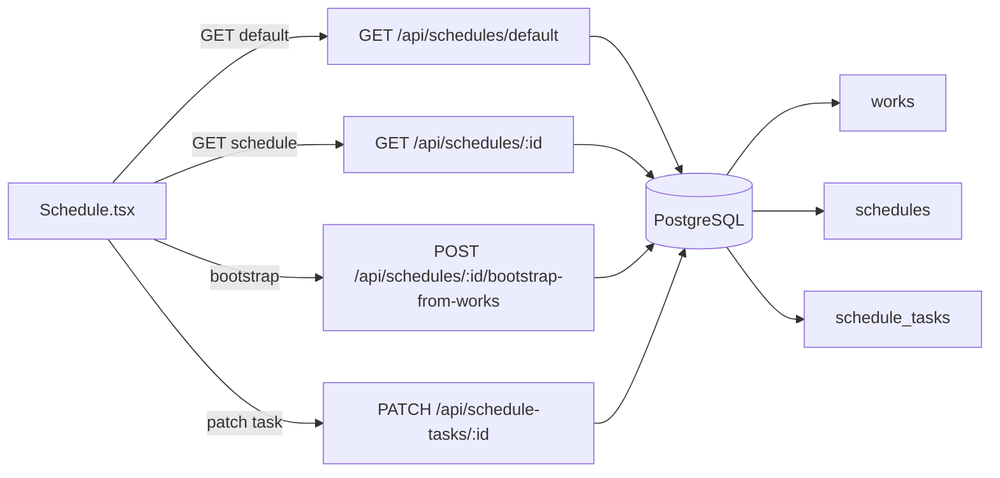

# Техзадание: «График работ» (диаграмма Ганта) — спецификация для агента

## 1) Контекст и цель
**Цель**: реализовать/поддерживать модуль «График работ» в формате диаграммы Ганта на базе ВОР/ВОИР (**works**) с ручным позиционированием задач по датам.

**Ключевая идея MVP**: 1 график = 1 проект (дефолтный график создаётся автоматически), задачи графика формируются из ВОР, далее пользователь вручную задаёт **startDate** и **durationDays**.

## 2) Глоссарий
- **ВОР/ВОИР (BoQ / works)**: справочник работ, импортируемых из Excel.
- **График (schedule)**: сущность проекта/графика работ, в MVP обычно используется дефолтный.
- **Задача графика (schedule_task)**: строка/бар в Ганте, связана с конкретной работой (**workId**) и содержит плановые даты/длительность.
- **Bootstrap**: создание задач графика из списка работ ВОР.
- **Идемпотентность**: повторный bootstrap не должен создавать дубликаты задач по одному и тому же workId.

## 3) Область работ (scope)
### Входит в scope (MVP)
- Создание/получение **дефолтного** графика работ.
- Получение графика по id вместе с задачами.
- Идемпотентное формирование задач из ВОР (всех или выбранных).
- Обновление задачи (дата начала, длительность, порядок, titleOverride).
- UI-экран `/schedule`: шкала по дням, список задач, отображение баров, ручные правки (через диалог и быстрый сдвиг).

### Не входит в scope (явно вне MVP)
- Несколько проектов/графиков с выбором пользователем (кроме ручного создания через API).
- Связи/зависимости между задачами (FS/SS/FF/SF), автоперерасчёты.
- Ресурсное планирование, критический путь, календарь выходных/праздников.
- Drag&drop для баров (может быть будущим улучшением).

## 4) Требования к данным (DB-модель)
Источник истины: `shared/schema.ts` (Drizzle + типы + Zod insert-схемы).

### 4.1 Таблица `schedules`
- **Назначение**: хранит графики (в MVP обычно один — дефолтный).
- **Поля**:
  - `id: serial PK`
  - `title: text NOT NULL`
  - `calendarStart: date NULL` — базовая дата календаря/шкалы
  - `createdAt: timestamp defaultNow()`

### 4.2 Таблица `schedule_tasks`
- **Назначение**: задачи/полосы Ганта, основанные на `works`.
- **Поля**:
  - `id: serial PK`
  - `scheduleId: int NOT NULL (FK → schedules.id)`
  - `workId: int NOT NULL (FK → works.id)`
  - `titleOverride: text NULL`
  - `startDate: date NOT NULL`
  - `durationDays: int NOT NULL` (ожидается `>= 1`)
  - `orderIndex: int NOT NULL` (0..N, в текущей реализации наращивается)
  - `createdAt: timestamp defaultNow()`
- **Индексы**:
  - `schedule_tasks_schedule_id_idx` (по scheduleId)
  - `schedule_tasks_work_id_idx` (по workId)
  - `schedule_tasks_schedule_order_idx` (scheduleId + orderIndex)

### 4.3 Инварианты и ограничения (качество данных)
- **durationDays** должен быть целым `>= 1`.
- **startDate** хранится как date (YYYY-MM-DD).
- В рамках одного графика **желательно** обеспечить уникальность `workId` (сейчас идемпотентность обеспечивается логикой bootstrap; уникальный индекс можно рассмотреть позже как улучшение).

## 5) API-контракт (источник истины: `shared/routes.ts`)
Все пути/методы/схемы должны быть синхронизированы с сервером (`server/routes.ts`) и клиентом (хуки `client/src/hooks/use-schedules.ts`).

### 5.1 Получить/создать дефолтный график
- **Метод/путь**: `GET /api/schedules/default`
- **Поведение**:
  - Если графика с `title="График работ"` нет — создать и вернуть.
  - Если есть — вернуть существующий.
- **Ответ**: `200` — объект `Schedule`.

### 5.2 Создать график (не основной сценарий MVP, но поддерживается)
- **Метод/путь**: `POST /api/schedules`
- **Тело**: `insertScheduleSchema` (без id/createdAt)
- **Ответы**:
  - `201` — `Schedule`
  - `400` — `{ message }`

### 5.3 Получить график по id (включая задачи)
- **Метод/путь**: `GET /api/schedules/:id`
- **Ответы**:
  - `200` — `Schedule & { tasks: ScheduleTask[] }` (tasks отсортированы по `orderIndex`)
  - `404` — `{ message }`

### 5.4 Bootstrap задач из ВОР
- **Метод/путь**: `POST /api/schedules/:id/bootstrap-from-works`
- **Тело**:
  - `workIds?: number[]` — если не передано, берём все работы
  - `defaultStartDate?: string` — YYYY-MM-DD
  - `defaultDurationDays?: number` — int >= 1
- **Поведение**:
  - Проверить, что schedule существует.
  - Получить список работ (все или по `workIds`), упорядочить (сейчас — по `works.code`).
  - Собрать существующие задачи графика по `workId`.
  - Для каждой работы, если задачи ещё нет — создать задачу со значениями по умолчанию.
  - Вернуть `{ scheduleId, created, skipped }`.
- **Ответы**:
  - `200` — `{ scheduleId, created, skipped }`
  - `400` — `{ message }` (например, невалидный id/тело)
  - `404` — `{ message }` (schedule not found)

### 5.5 Обновить задачу графика
- **Метод/путь**: `PATCH /api/schedule-tasks/:id`
- **Тело** (частичное обновление):
  - `titleOverride?: string | null`
  - `startDate?: string` (YYYY-MM-DD)
  - `durationDays?: number` (int >= 1)
  - `orderIndex?: number` (int >= 0)
- **Поведение**:
  - Если в patch нет ни одного поля — ошибка.
  - Обновить запись и вернуть обновлённую задачу.
- **Ответы**:
  - `200` — `ScheduleTask`
  - `400` — `{ message }`
  - `404` — `{ message }` (task not found)

## 6) Backend: требования к реализации (Express + Storage)
### 6.1 Источники кода
- Роутинг: `server/routes.ts`
- Доступ к данным: `server/storage.ts`
- Контракт/валидация: `shared/routes.ts` (Zod)

### 6.2 Правила реализации
- **Синхронизация контрактов**: сервер обязан парсить вход через схемы из `shared/routes.ts` и формировать ответы в соответствии с контрактом.
- **Идемпотентность bootstrap**: повторный вызов не создаёт дубликаты задач в одном schedule.
- **Сортировка задач**: `GET /api/schedules/:id` возвращает задачи, отсортированные по `orderIndex`.
- **Ошибки**:
  - Невалидные `id` → `400`.
  - Несуществующий schedule/task → `404` с понятным message.
- **Транзакции**: bootstrap выполняется в транзакции.

## 7) Frontend: требования к реализации (React + TanStack Query)
### 7.1 Источники кода
- Экран: `client/src/pages/Schedule.tsx`
- Хуки: `client/src/hooks/use-schedules.ts`
- ВОР: `client/src/hooks/use-works.ts` (для отображения code/description)

### 7.2 Обязательные сценарии UI
- **Первый вход на экран**:
  - запросить `GET /api/schedules/default`
  - получить `id`, затем запросить `GET /api/schedules/:id`
- **Пустой график** (нет задач):
  - показать empty-state и кнопку “Создать из ВОР/Обновить из ВОР”
- **Bootstrap**:
  - по нажатию вызвать `POST /api/schedules/:id/bootstrap-from-works`
  - после успеха перезагрузить schedule (invalidate query)
- **Редактирование задачи**:
  - диалог редактирования `startDate` и `durationDays`
  - быстрый сдвиг `startDate` на -1/+1 день
  - после update — invalidate schedule query

### 7.3 Правила отображения Ганта (как сейчас / целевой минимум)
- Горизонтальная шкала по дням (date-fns).
- Бар задачи:
  - позиция \(left = (startDate - calendarStart) * dayWidth\)
  - ширина \(width = durationDays * dayWidth\)
- Горизонтальный скролл по шкале/полю.
- Рекомендация landscape (текстовая подсказка).

### 7.4 i18n
- Экран использует `useLanguageStore` и `translations`.
- Все пользовательские строки должны иметь ru/en варианты (как минимум).

## 8) Нефункциональные требования
- **KISS/DRY/SOLID**: не дублировать схемы/валидацию между слоями.
- **Надёжность**: любые сетевые/серверные ошибки должны быть отработаны (message пользователю/логирование на сервере).
- **Производительность**:
  - `GET schedule` не должен делать N+1 запросов на каждую задачу (сейчас: 1 запрос schedule + 1 запрос tasks — ок).
  - UI ограничивает число дней шкалы (как минимум 30..90 дней) для читаемости/скорости.

## 9) Критерии приемки (Acceptance Criteria)
1. При первом открытии `/schedule` создаётся/подтягивается дефолтный график и успешно отображается.
2. При отсутствии задач UI показывает empty-state и кнопку bootstrap.
3. Bootstrap создаёт задачи из ВОР **без дублей** при повторном запуске (created/skipped корректны).
4. Любая правка задачи (startDate/durationDays) сохраняется через `PATCH` и видна после перезагрузки страницы.
5. `GET /api/schedules/:id` всегда возвращает задачи в порядке `orderIndex`.

## 10) Smoke-test сценарий (ручной)
1. Импортировать ВОР (works).
2. Открыть `/schedule`, нажать “Создать из ВОР”.
3. Сдвинуть одну задачу на +1 день и сохранить длительность = 3.
4. Перезагрузить страницу: изменения должны сохраниться.

## 11) Диаграммы (Mermaid)
### 11.1 Поток данных

## 12) Рекомендации на будущее (не делать в MVP без отдельного согласования)
- Уникальный индекс `(schedule_id, work_id)` для железобетонной идемпотентности.
- Drag&drop редактирование баров/строк (start/duration/order).
- Авто-раскладка по календарю/зависимостям.
- Несколько графиков (мульти-проекты) + выбор графика.

